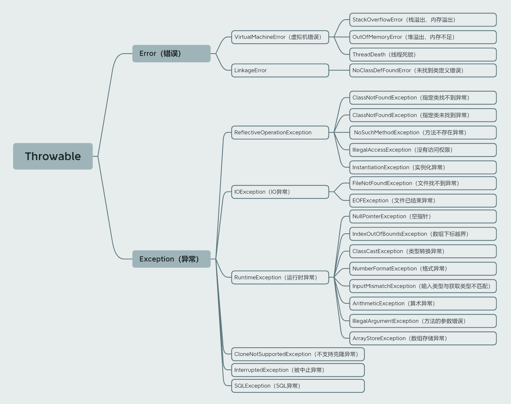

## 异常概述

（1）在Java语言中，将程序运行过程中，由于某些原因导致程序出错，从而结束程序运行，称为“异常”  (开发过程中的语法错误和逻辑错误不是异常)

（2）在 Java 中一个异常的产生，主要有如下三种原因

| 异常事件  | 简介                                                         |
| --------- | ------------------------------------------------------------ |
| Error     | Java 内部错误发生异常，Java 虚拟机产生的异常。Java虚拟机无法解决的严重问题，`一般不编写针对性的代码进行处理`，如：JVM系统内部错误、资源耗尽等严重情况 |
| Exception | 因编程错误或偶然的外在因素导致的一般性问题，可以使用针对性的代码进行处理。  例如：空指针访问、数组角标越界、试图读取不存在的文件、网络连接中断等，这种异常称为未检査的异常，一般需要在某些类中集中处理这些异常 |
| throw生成 | 通过 throw 语句手动生成的异常，这种异常称为检査的异常，一般用来告知该方法的调用者一些必要的信息 |

（3）对于这些错误，一般有两种解决方法，一种是遇到错误就终止程序的运行，另一种方法是由程序员在编写程序时，就考虑到错误的检测、错误消息的提示，以及错误的处理。 

 （4）捕获错误最理想的是在编译期间，但有的错误只有在运行时才会发生。

（5）异常主要分为两种，分别是编译时异常和运行时异常

| 异常分类   | 简介                                                         |
| ---------- | ------------------------------------------------------------ |
| 编译时异常 | 是指编译器要求必须处置的异常，即程序在运行时由于外界因素造成的一 般性异常。  编译器要求Java程序必须捕获或声明所有编译时异常，对于这类异常，如果程序不处理，可能会带来意想不到的结果 |
| 运行时异常 | 是指编译器不要求强制处置的异常，一般是指编程时的逻辑错误，是程序员应该积极避免其出现的异常。  java.lang.RuntimeException类及它的子类都是运行时异常。  对于这类异常，可以不作处理，因为这类异常很普遍，若全处理可能会对程序的可读性和运行效率产生影响。 |

（6）只要一个异常类的祖先类中有RuntimeException，那么就是运行时异常，否则是编译时异常

## 异常体系结构



### java.lang.Error（严重错误）

#### java.lang.OutOfMemoryError（堆溢出）

```java
// java.lang.OutOfMemoryError堆溢出代码示例
public class ErrorTest {
	public static void main(String[] args) {
		Long[] arr = new Long[1024*1024*1024];
	}
}
```

#### java.lang.StackOverflowError（栈溢出）

```java
// java.lang.StackOverflowError栈溢出代码示例
public class ErrorTest {
	public static void main(String[] args) {
		main(args);
	}
}
```

### Exception（运行时异常和编译时异常）

#### java.lang.RuntimeException（运行时异常）

（1）ArithmeticException（算数的异常）

```java
@Test
public void test1(){
	int num1 = 3;
	int num2 = 0;
	int num3 = 3 / 0;
}
```

（2）InputMismatchException（输入类型与获取类型不匹配）

```java
@Test
public void test2(){
	Scanner scanner = new Scanner(System.in);
	int i = scanner.nextInt();
	System.out.println(i);
	scanner.close();
}
```

（3）NumberFormatException（格式异常）

```java
@Test
public void test3(){
	String str = "abcd";
	int num = Integer.parseInt(str);
}
```

（4）InputMismatchException（类型转换异常）

```java
@Test
public void test4(){
	Object obj = new Boolean(true);
	String str = (String)obj;
}
```

（5）IndexOutOfBoundsException（角标越界）

```java
@Test
public void test5(){
	ArrayIndexOutOfBoundsException
	Byte[] bytes = new Byte[3];
	System.out.println(bytes[4]);
}
```

（6）java.lang.NullpointerException（空指针异常）

```java
@Test
public void test6(){
	int[] arr = null;
	System.out.println(arr[1]);
}
```

#### 编译时异常

```java
@Test
public void test7(){
	File file = new File("a.txt");
	// java.io.FileNotFoundException（文件找不到异常）
	FileInputStream fis = new FileInputStream(file);
	// java.io.IOException（IO异常）
	int date = fis.read();
	while (date != -1){
 		System.out.println((char)date);
		date = fis.read();
	}
	fis.close();
}
```

## 异常的处理

程序员通常只能处理Exception，而对Error无能为力，子类重写的方法抛出的异常类型不大于父类被重写的方法抛出的异常类型

| 异常处理              | 简介                                                         |
| --------------------- | ------------------------------------------------------------ |
| 抛出异常（throw）     | 只是将异常抛给了方法的调用者，并没有真正将异常处理掉，在方法声明的位置上使用throws关键字向上抛出异常，异常抛给了当前方法的调用者，即谁调用这个方法，谁就会得到这个异常，可以使用throws关键字将异常抛出，由于是JVM调用的main方法，所以这个异常抛给了JVM，JVM会将异常信息打印到控制台 |
| 捕获异常（try-catch） | 真正的将异常给处理掉了，如果一个方法内抛出异常，该异常对象会被抛给调用者方法中处理。<br>如果异常没有在调用者方法中处理，会继续被抛给这个调用方法的上层方法，此过程将一直继续下去，直到异常被处理 |

### 捕获异常（catch）

#### try-catch-finally语法

```java
try{
	// 可能出现异常的代码
}catch(异常类型1 变量名1){
    // 处理异常的方式1
}catch(异常类型2 变量名2){
	// 处理异常的方式2
}catch(异常类型n 变量名n){
    // 处理异常的方式n
	....
finally{
	// 一定会执行的代码
}
```

#### try-catch-finally执行流程

```
使用try将可能出现异常代码包装起来，一旦出现异常，就会生成一个对应异常类的对象，根据此对象的类型、去catch中进行匹配
一旦try中的异常对象匹配到某一个catch时，就进入catch中进行异常的处理
一旦处理完成，就跳出当前的try-catch结构（在没有写finally的情况），继续执行其后的代码
finally是可选的，finally中声明的是一定会被执行的代码
即使catch中又出现了异常、try中有return语句、catch中有return语句等情况finally中声明的代码都会被执行
```

#### try-catch-finally使用注意

（1）catch中的异常类型如果没有子父类关系，则谁声明在上，谁声明在下无所谓

（2）catch中的异常类型如果满足子父类关系，则要求子类一定声明在父类的上面，否则报错

（4）try-catch-finally结构可以嵌套，在try结构中声明的变量，在出了try结构以后，就不能再被调用

（5）像数据库连接、输入输出流、网络编程Socket等资源，JVM是不能自动的回收的，需要自己手动的进行资源的释放（如close关闭操作），此时的资源释放，就需要声明在finally中

（4）使用try-catch-finally处理编译时异常，使得程序在编译时就不再报错，但是运行时仍可能报错，相当于我们使用try-catch-finally将一个编译时可能出现的异常，延迟到运行时出现

（5）开发中，由于运行时异常比较常见，所以我们通常就不针对运行时异常编写try-catch-finally了，针对编程时的异常，我们一定要考虑异常的处理

#### 常见的异常处理方式

| 方法               | 简介                                         |
| ------------------ | -------------------------------------------- |
| e.toString()       | 获得异常种类和错误信息                       |
| e.getMessage()     | 获得错误信息                                 |
| e.prntStackTrace() | 在控制台打印出异常种类，错误信息和出错位置等 |

#### try-catch-finally代码示例

（1）示例一

```java
@Test
public void test1(){
	String str = "abcd";
	int num = 1314;
	try {
		num = Integer.parseInt(str);
		System.out.println("进入try代码块!");
	}catch (NumberFormatException e){
		// 手动定义错误信息
		System.out.println("出现数值转换异常了！");
		//获得异常种类和错误信息(toString可以不加，默认有)
		System.out.println(e.toString());
		//e.getMessage()：获得错误信息
		System.out.println(e.getMessage());
		// e.printStackTrace()：在控制台打印出异常种类，错误信息和出错位置等
		e.printStackTrace();
		System.out.println("该catch语句块将要执行完了！");
	} catch (NullPointerException e){
		System.out.println("出现空指针异常！");
	} catch (Exception e){
		System.out.println("出现异常了");
	}finally {
		System.out.println("执行finally语句了！");
	}
	System.out.println(num);
}
```

（2）示例二

```java
@Test
public void test2(){
	FileInputStream fis = null;
	try {
		//1.实例化File类的对象，指明要操作的文件
		File file = new File("a.txt");
		 //2.提供具体流
		fis = new FileInputStream(file);
		//3.数据的读入
		//read()：返回读入的一个字符，如果达到文件末尾，返回-1
		int date = fis.read();
		while(date != -1){
			System.out.println((char)date);
			date = fis.read();
		}
	} catch (FileNotFoundException e) {
		e.printStackTrace();
	} catch (IOException e){
		e.printStackTrace();
	}finally {
		System.out.println("执行finally语句了！");
		try {
			//4.流的关闭操作
			fis.close();
		} catch (IOException e) {
			e.printStackTrace();
		}
	}
}
```

### 抛出异常（throw）

| 对比   | 区别                                                         |
| ------ | ------------------------------------------------------------ |
| throws | 用在方法声明中，后面跟的是异常类，后面可以跟多个异常类名，用逗号隔开，表示抛出异常，由该方法的调用者来处理 |
| throw  | 用在方法体内，后面跟的是异常对象，只能抛出一个异常对象，表示抛出异常，由方法体内的语句处理或抛出 |

#### 使用throws关键字抛出异常

throws的作用是抛出异常，在方法声明的位置上使用throws关键字向上抛出异常，异常抛给了当前方法的调用者，即谁调用这个方法，谁就会得到这个异常，可以使用throws关键字将异常抛出，由于是JVM调用的main方法，所以这个异常抛给了JVM，JVM会将异常信息打印到控制台

```java
修饰符 返回值类型 方法名(参数类型 形参) throws 异常类型1,异常类型2｛ 
	方法体程序代码
	return 返回值;
｝
```

#### 使用throw语句抛出异常对象

```java
public class ReturnException {
	public static void main(String[] args) {
		methodTest();
	}
    
	// 静态方法
	static void methodTest(){
		try{
			System.out.println("进入方法");
			throw new RuntimeException("手动抛出异常");
		}catch (Exception e){
			e.printStackTrace();
			System.out.println(e.getMessage());
		} finally {
			System.out.println("执行finally语句了！");
		}
	}
}
```

## 自定义异常类

（1）一般用户自定义异常类都是RuntimeException的子类，使用时需要通过throw抛出

（2）自定义异常类的步骤

```java
1、继承于现有的异常结构：RuntimeException 、Exception
2、提供全局常量：serialVersionUID
3、提供重载的构造器
```

（3）自定义异常MyException代码示例

```java
public class MyException extends Exception {
    // 提供全局常量：serialVersionUID
    static final long serialVersionUID = -5641210210148784L;

    // 用于保存异常发生的原因
    private String message;

    // 构造器
    public MyException() {
    }

    // 构造器
    public MyException(String message) {
        super(message);
        this.message = message;
    }
    
}
```

