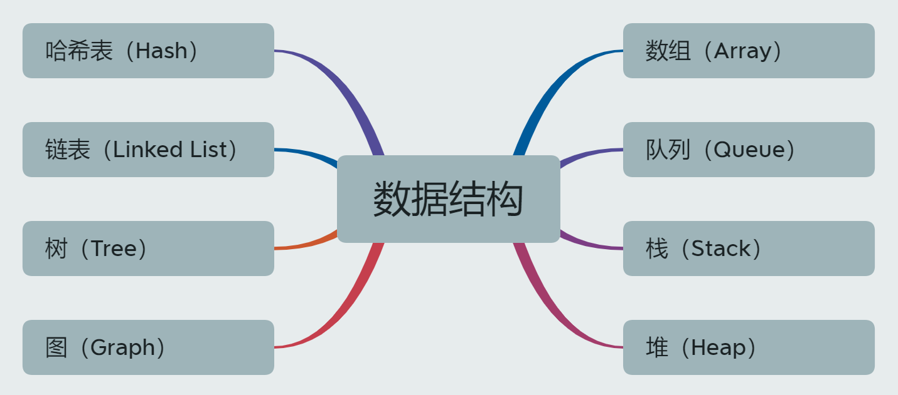
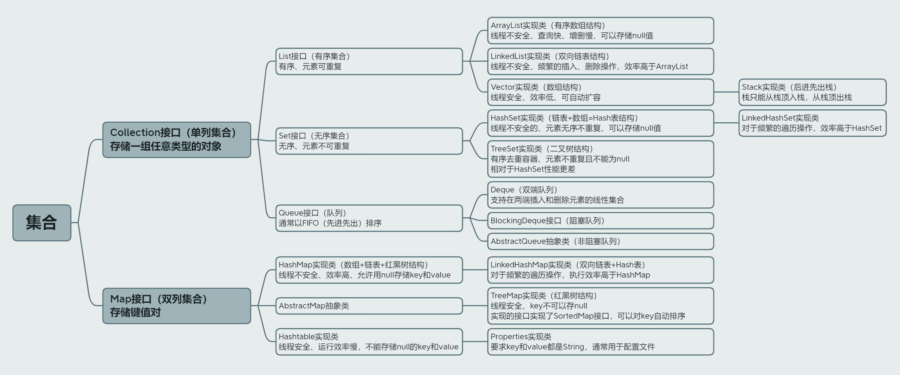
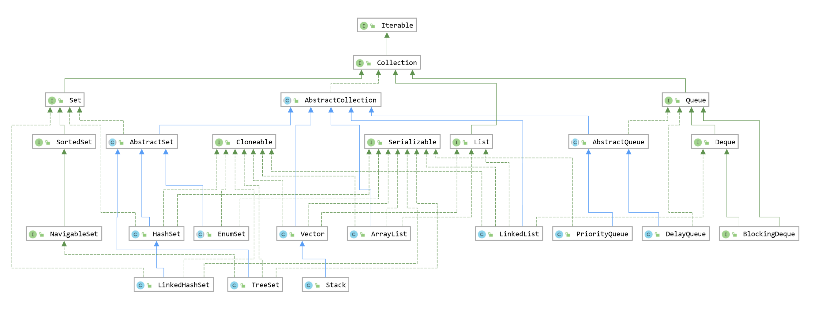
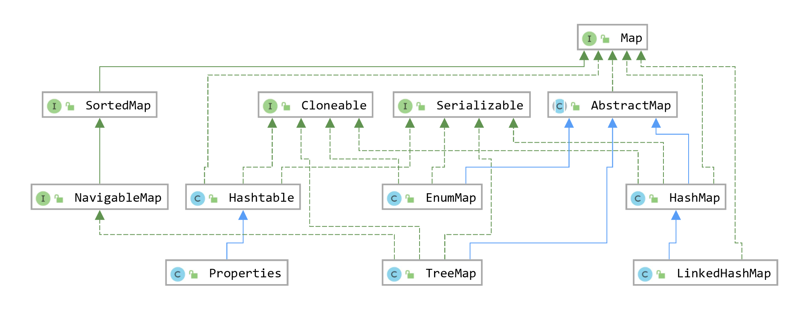

## Java常见数据结构



| 数据结构          | 简介                                                         |
| ----------------- | ------------------------------------------------------------ |
| 数组(Array)       | 采用一段连续的存储单元来存储数据                             |
| 队列(Queue)       | 队列是一种特殊的线性表，只允许在表的前端进行删除操作，而在表的后端进行插入操作 |
| 哈希表(Hash)      | 哈希表也叫散列表                                             |
| 链表(Linked List) | 链表是一种线性表的链式存储方式，通过一个指向下一个元素地址的引用将链表中的元素串起来 |
| 栈(Stock)         | 栈可以类比为水桶，只有一端能够进出，遵循的先进后出的规则，先进的元素进入栈底，读元素的时候从栈顶取元素。 |
| 堆(Heap)          | 堆可以被看成一个树的数组对象                                 |
| 树(Tree)          | 是一种物理存储单元上非连续、非顺序的存储结构                 |
| 图(Graph)         | 数据结构中的元素存在多对多的相互关系                         |

## Java集合框架概述

（1）在Java中我们可以使用数组来保存多个对象，但数组Array长度是固定的，如果要改变数组的长度需要通过数组拷贝的方式，使用起来不太方便。为了保存数量不确定的数据，以及保存具有映射关系的数据（也被称为关联数组），Java 给开发者提供了一些集合类，能够存储任意长度的对象数据，长度可以随着元素的增加而增加，随着元素的减少而减少，使用起来方便一些，Java集合就像一种容器，可以动态的把多个对象的引用放入容器中

（2）数组与集合的对比

| 数组与集合 | 对比                                                         |
| ---------- | ------------------------------------------------------------ |
| 数组       | 数组初始化以后，长度就确定了，不便于拓展<br>数组声明的类型，就决定了进行元素初始化的类型<br>获取数组中实际元素的个数的需求，数组没有现成的属性或方法可用<br>数组存储的数据是有序的、可以重复的，对于无序、不可重复的需求，不能满足<br/>数组中提供的属性和方法少，不便于进行添加、删除、插入等操作，且效率不高 |
| 集合       | Java集合类可以用于存储数量不等的多个对象，还可以用于保存具有映射关系的关联数组 |

## 集合体系结构



```
Collection接口：对象的集合（单列集合）
├——-List接口：有序集合，元素按进入先后有序保存，元素可重复
│—————-├ ArrayList实现类： 有序数组结构、线程不安全、查询快、增删慢、允许放入null元素
│—————-├ LinkedList实现类： 双向链表结构、线程不安全、对于频繁的插入、删除操作，效率高于ArrayList;
│—————-└ Vector实现类：数组结构、线程安全、效率低、可自动扩容、list接口的古老实现类
│ ———————-└ Stack： 后进先出栈结构、继承Vector类
└——-Set接口：无序集合，元素仅接收一次，不可重复，并做内部排序
├—————-└HashSet实现类：hash表结构（链表+数组）、线程不安全的、元素无序不重复、可以存储null值
│————————└ LinkedHashSet实现类：对于频繁的遍历效率高于HashSet
└ —————-TreeSet实现类：二叉树结构、线程不安全、有顺序的去重集合容器、元素没有重复不可以是null、相对于HashSet, 性能更差
└——-Queue接口：队列结构、通常以FIFO（先进先出）方式对元素排序获取
└ —————-└Deque接口：双端队列结构、支持在两端插入和删除元素的线性集合

Map接口：键值对的集合 （双列集合）
├———HashMap实现类：数组+链表+红黑树结构、无序、线程不安全、效率高、允许用null存储key和value
│—————–└ LinkedHashMap实现类：双向链表和哈希表结构、有序、效率高于HashMap
├ ——–TreeMap实现类：红黑树结构、线程安全、key不可以存null
├———Hashtable实现类：古老的实现类、线程安全、效率低、不能存储null的key和value
└ —————-Properties实现类：常用来处理配置文件，key和value都是String类型
```


### 单列集合Collection体系



| 单列集合            | 简介                                                         |
| ------------------- | ------------------------------------------------------------ |
| Collection接口      | 单列数据，定义了存取一组对象的方法的集合                     |
| List接口            | 存储元素`有序`、`可重复`的集合，元素按进入先后有序保存，元素可重复 |
| Set接口             | 存储元素`无序`、`不可重复`的集合，元素仅接收一次，不可重复，并做内部排序 |
| Queue接口           | 队列结构，通常以FIFO（先进先出）方式对元素排序获取           |
| ArrayList实现类     | ArrayList是一个有顺序的容器，底层是一个数组，不过它是会进行动态扩容，作为list接口的主要实现类，线程不安全，效率高，底层使用Object[] elementData存储，允许放入null元素。查询快、增删慢 |
| LinkedList实现类    | 底层使用双向链表存储，对于频繁的插入、删除操作，使用此类效率比ArrayList高； |
| Vector实现类        | 作为list接口的古老实现类，线程安全，可以进行自动扩容，效率低，底层使用Object[] elementData存储 |
| Stack实现类         | 继承Vector类，后进先出栈                                     |
| HashSet实现类       | 线程不安全的，作为Set接口的主要实现类，集合中的元素不重复，可以存储null值，是无序的，即不会记录插入的顺序 |
| LinkedHashSet实现类 | 线程不安全，可以存储null值，元素有顺序，维护了添加顺序，元素没有重复，作为HashSet的子类，遍历其内部数据时，可以按照添加的顺序遍历，对于频繁的遍历操作，LinkedHashSet效率高于HashSet |
| TreeSet实现类       | 线程不安全，有顺序的去重集合容器，元素没有重复，集合中的元素不可以是null，相对于HashSet, 性能更差，可以按照添加的对象指定属性，进行排序 |
| Deque接口           | 双端队列结构，支持在两端插入和删除元素的线性集合             |

### 双列集合Map体系



| 双列集合            | 简介                                                         |
| ------------------- | ------------------------------------------------------------ |
| Map接口             | 双列数据，保存具有映射关系“key-value对”的集合    ——类似高中的函数：y=f(x) |
| HashMap实现类       | 作为Map的主要实现类，线程不安全的，效率高，存储null的key和value |
| LinkedHashMap实现类 | 双向链表和哈希表结构，保证在遍历map元素时，可以按照添加的顺序实现遍历  原因：在原有的HashMap底层结构基础上，添加了一对指针，指向前一个和后一个元素  对于频繁的遍历操作，此类执行效率高于HashMap |
| TreeMap实现类       | 底层使用红黑树，保证按照添加的key-value对进行排序，实现排序遍历，此时考虑key的自然排序或定制排序 |
| Hashtable实现类     | 作为古老的实现类，线程安全的，效率低，不能存储null的key和value |
| Properties实现类    | 常用来处理配置文件，key和value都是String类型                 |


 ## Iterator迭代器接口

（1）迭代器是一种通用的遍历集合，取出集合中元素的方式，Java提供了Iterator迭代器接口，主要用于遍历 Collection 集合中的元素，但Iterator 本身不提供承装对象的能力。。

（2）Iterator 本身不提供承装对象的能力，而是提供了一个iterator()方法，用以返回一个实现了 Iterator接口的对象，如果需要创建 Iterator 对象，则必须有一个被迭代的集合

（3）Collection接口继承了java.lang.Iterable接口，所有实现了Collection接口的集合类都有一个iterator()方法，集合对象每次调用iterator()方法都得到一个全新的迭代器对象，默认游标都在集合的第一个元素之前

（4）Iterator接口的方法

| 方法       | 简介                                                         |
| ---------- | ------------------------------------------------------------ |
| iterator() | 返回迭代器对象，用于集合遍历，集合每次调用iterator()方法都得到一个全新的迭代器对象 |
| hasNext()  | 判断是否还有下一个元素                                       |
| next()     | ①指针下移 ②将下移以后集合位置上的元素返回                    |
| remove()   | 内部定义了remove()，可以在遍历的时候，删除集合中的元素，此方法不同于集合中直接调用的remove()方法 |

## Comparable比较器接口

java中的对象，正常情况下，只能进行比较等于或不等（==、!=），不能使用大于小于（>、<）进行比较，但是在开发场景中，有时需要对多个对象进行排序，就需要比较对象的大小，这时可以使用两个接口中的任何一个

| 接口                 | 简介                                                         |
| -------------------- | ------------------------------------------------------------ |
| java.lang.Comparable | 自然排序，接口方式一旦指定，保证Comparable接口实现类的位置在任何位置都可以比较大小 |
| java.util.Comparator | 自然排序，属于临时性的比较                                   |

### Comparable接口（自然排序）

（1）像String、包装类等实现了Comparable 接口，重写了compareTo(T o)方法，给出了比较两个对象大小的方式，进行从小到大排序

（2）重写CompareTo(obj)方法的规则

```
如果当前对象this大于形参对象obj，则返回正整数
如果当前对象this小于形参对象obj，则返回负整数
如果当前对象this等于形参对象obj，则返回零
```

（3）对于自定义类来说，如果需要排序，可以让自定义类实现Comparable接口并重写compareTo(T o)方法，在compareTo(T o)方法中指定如何排序

（4）自定义类代码举例

首先创建Goods类实现Comparable接口重写compareTo(T o)方法

```java
class Goods implements Comparable {
    private String name;
    private double price;

    // 照价格从低到高排序，再照产品名称从高到低排序
    @Override
    public int compareTo(Object o) {
        if (o instanceof Goods) {
            Goods goods = (Goods) o;
            if (this.price > goods.price) {
                return 1;
            } else if (this.price < goods.price) {
                return -1;
            } else {
                // return 0;
                return -this.name.compareTo(goods.name);
            }
        }
        throw new RuntimeException("输入的数据类型不一致");
    }

    public Goods(String name, double price) {
        this.name = name;
        this.price = price;
    }

    public String getName() {
        return name;
    }

    public void setName(String name) {
        this.name = name;
    }

    public double getPrice() {
        return price;
    }

    public void setPrice(double price) {
        this.price = price;
    }

    @Override
    public String toString() {
        return "Goods{" +
                "name='" + name + '\'' +
                ", price=" + price +
                '}';
    }
}
```

然后创建Goods类型数组

```java
public class ComparableTest {
    public static void main(String[] args) {
        Goods[] goods = new Goods[4];
        goods[0] = new Goods("《红楼梦》", 70);
        goods[1] = new Goods("《西游记》", 50);
        goods[2] = new Goods("《三国演义》", 60);
        goods[3] = new Goods("《水浒传》", 80);
        Arrays.sort(goods);// 对括号中的数组进行排序
        System.out.println(Arrays.toString(goods));
        // [Goods{name='《西游记》', price=50.0}, Goods{name='《三国演义》', price=60.0}, Goods{name='《红楼梦》', price=70.0}, Goods{name='《水浒传》', price=80.0}]
    }
}
```


### Comparator接口（定制排序）

（1）当元素的类型没有实现java.lang.Comparable接口而又不方便修改代码，或者实现了java.lang.Comparable接口的排序规则不适合当前的操作，那 么可以考虑使用 Comparator 的对象来排序

（2）重写compare(Object o1,Object o2)方法，比较o1和o2的大小

```
如果方法返 回正整数，则表示o1大于o2;
如果返回0，表示相等;
返回负整数，表示 o1小于o2。
```

（3）代码示例

```java
public class ComparatorTest {
    public static void main(String[] args) {
        Goods[] goods = new Goods[4];
        goods[0] = new Goods("《红楼梦》", 70);
        goods[1] = new Goods("《西游记》", 50);
        goods[2] = new Goods("《三国演义》", 60);
        goods[3] = new Goods("《水浒传》", 80);
        Arrays.sort(goods, new Comparator() {
            @Override
            public int compare(Object o1, Object o2) {
                Goods g1 = (Goods) o1;
                Goods g2 = (Goods) o2;
                return g1.getName().compareTo(g2.getName());
            }
        });
        System.out.println(Arrays.toString(goods));
    }
}
```

## Collection接口（单列集合）

### Collection接口简介

（1）java.util.Collection 接口是 List、Set 和 Queue 接口的父接口，该接口里定义的方法 既可用于操作 Set 集合，也可用于操作 List 和 Queue 集合

（2）JDK不提供此接口的任何直接实现，而是提供更具体的子接口（Set和List）实现

（3）在 Java5 之前，Java 集合会丢失容器中所有对象的数据类型，把所有对象都 当成 Object 类型处理；从 JDK 5.0 后增加了泛型以后，Java 集合可以记住容 器中对象的数据类型。

### Collection接口方法

#### 添加操作

| 方法名                          | 作用                         |
| ------------------------------- | ---------------------------- |
| add()                           | 添加单个数据，结果返回布尔值 |
| addALl(Collection<? extends E>) | 批量添加                     |

```java
@Test
public void test() {
    // add(Object obj)：添加单个数据，结果返回布尔值
    Collection arrayList = new ArrayList();
    arrayList.add("AA");
    arrayList.add(123);
    System.out.println(arrayList);// [AA, 123]

    // addAll()：批量添加
    Collection newArrayList = new ArrayList();
    newArrayList.addAll(arrayList);
    System.out.println(newArrayList);// [AA, 123]
}
```

#### 删除操作

| 方法名                         | 作用                                                     |
| ------------------------------ | -------------------------------------------------------- |
| remove()                       | 删除单个数据，结果返回布尔值                             |
| removeALL(Collection<?>)       | 批量删除，取差集，，从当前集合中移除另一集合中相同的元素 |
| retainAll(Collection<?>)       | 批量删除，取交集                                         |
| removeIF(Predicate<? super E>) | 条件删除，参数是过滤器，判断元素是否要删除               |
| clear()                        | 清空集合                                                 |

```java
public class Demo {
    @Test
    public void test1() {
        // add(Object obj)：添加单个数据，结果返回布尔值
        Collection arrayList = new ArrayList();
        arrayList.add("AA");
        arrayList.add(123);
        System.out.println(arrayList);// [AA, 123]

        // remove()：删除单个数据，结果返回布尔值
        arrayList.remove(123);// 删除123
        System.out.println(arrayList);// [AA]

        // removeIF(Predicate<? super E>)：条件删除，参数是过滤器，判断元素是否要删除
        arrayList.removeIf(test -> test.equals("AA"));// 删除AA
        System.out.println(arrayList);// []

        // clear()：清空集合
        arrayList.clear();// []
    }

    @Test
    public void test2() {
        Collection arrayList1 = new ArrayList();
        arrayList1.add("AA");
        arrayList1.add(123);
        Collection arrayList2 = new ArrayList();
        arrayList2.add("BB");
        arrayList2.add(123);
        // removeAll(Collection coll)：取差集，从当前集合中移除另一集合中相同的元素
        arrayList1.removeAll(arrayList2);
        System.out.println(arrayList1);// [AA]
    }

    @Test
    public void test3() {
        Collection arrayList1 = new ArrayList();
        arrayList1.add("AA");
        arrayList1.add(123);
        Collection arrayList2 = new ArrayList();
        arrayList2.add("BB");
        arrayList2.add(123);
        // retainAll(Collection c)：取交集，获取当前集合和另一集合的交集，并返回给当前集合
        arrayList1.retainAll(arrayList2);
        System.out.println(arrayList1);// [123]
    }
}
```

#### 查询操作

| 方法名                     | 作用                                                 |
| -------------------------- | ---------------------------------------------------- |
| size()                     | 返回此集合中有效的元素数。                           |
| isEmpty()                  | 是否是空集合，如果集合中不包含元素，则返回 true 。   |
| contains(Object o)         | 是否包含元素，如果此集合包含指定的元素，则返回true。 |
| containsAll(Collection<?>) | 如果此集合包含指定集合中的所有元素，则返回true。     |
| equals(Object obj)         | 判断集合元素是否相等                                 |
| hashCode()                 | 返回当前对象的哈希值                                 |

```java
public class Demo {
    @Test
    public void test() {
        Collection arrayList = new ArrayList();
        arrayList.add("AA");
        Collection newArrayList = new ArrayList();
        newArrayList.add("AA");

        // size()：获取添加的元素个数
        System.out.println(arrayList.size());// 1

        // isEmpty()：判断集合是否为空
        System.out.println(arrayList.isEmpty());// false

        // contains(Object o)：是否包含元素，如果此集合包含指定的元素，则返回true
        System.out.println(arrayList.contains("AA"));// true
        
        // containsAll(Collection<?>)：如果此集合包含指定集合中的所有元素，则返回true。
        System.out.println(arrayList.containsAll(newArrayList));// true

        // equals(Object obj)：判断集合元素是否相等
        System.out.println(arrayList.equals(newArrayList));// true

        // hashCode()：返回当前对象的哈希值
        System.out.println(arrayList.hashCode());// 2111
    }
}
```

#### 转换操作

| 方法名    | 作用                                                         |
| --------- | ------------------------------------------------------------ |
| toArray() | 集合 —> 数组，正确的顺序返回一个包含此列表中所有元素的数组（从第一个到最后一个元素） |

```java
public class Demo {
    @Test
    public void test() {
        Collection arrayList = new ArrayList();
        arrayList.add("AA");
        arrayList.add("BB");
        arrayList.add("CC");
        System.out.println(arrayList);// [AA, BB, CC]

        // toArray()：集合 —> 数组，正确的顺序返回一个包含此列表中所有元素的数组（从第一个到最后一个元素）
        Object[] arr = arrayList.toArray();
        for (int i = 0; i < arr.length; i++) {
            System.out.println(arr[i]);
        }

        // 扩展：数组 —> 集合，调用Arrays类的静态方法asList()创建集合
        Collection<String> asList = Arrays.asList("AA", "BB", "CC");
        System.out.println(asList);// [AA, BB, CC]
    }
}
```

#### 遍历操作

| 方法名     | 作用                                           |
| ---------- | ---------------------------------------------- |
| iterator() | 返回Iterator迭代器接口的示例，用于遍历集合元素 |

```java
public class Demo {
    Collection<String> asList = Arrays.asList("AA", "BB", "CC");
    // iterator()：返回Iterator接口的示例，用于遍历集合元素
    Iterator iterator = asList.iterator();

    @Test
    public void test1() {
        // 方式一：使用next()使指针下移，将下移以后集合位置上的元素返回
        System.out.println(iterator.next());// AA
        System.out.println(iterator.next());// BB
        System.out.println(iterator.next());// BB
    }

    @Test
    public void test2() {
        // 方式二：使用for循环+next()
        for (int i = 0; i < asList.size(); i++) {
            System.out.println(iterator.next());
        }
    }

    @Test
    public void test3() {
        // 方式三：使用hasNext()判断是否还有下一个元素，然后使用next()指针下移，将下移以后集合位置上的元素返回
        while (iterator.hasNext()) {
            System.out.println(iterator.next());
        }
    }

    @Test
    public void test4() {
        // 使用增强for循环foreach，内部仍然调用了迭代器
        // 语法：for(集合元素的类型 局部变量:集合对象){}
        for (Object obj : asList) {
            System.out.println(obj);
        }
    }
}
```

#### 其他操作

| 方法名           | 作用                                                         |
| ---------------- | ------------------------------------------------------------ |
| stream()         | 返回一个顺序Stream与此集合作为其来源。                       |
| parallelStream() | 返回可能并行的Stream与此集合作为其来源。 该方法允许返回顺序流。 |

```java
public class Demo {
    @Test
    public void test() {
        Collection<String> asList = Arrays.asList("AA", "BB", "CC");
        List<String> collect1 = asList.stream().collect(Collectors.toList());
        System.out.println(collect1);// [AA, BB, CC]
        List<String> collect2 = asList.parallelStream().collect(Collectors.toList());
        System.out.println(collect2);// [AA, BB, CC]
    }
}
```

### List接口（有序）

#### List接口简介

（1）鉴于Java中数组用来存储数据的局限性，我们通常使用List替代数组

（2）List集合类中元素有序、且可重复，集合中的每个元素都有其对应的顺序索引。

（3）List容器中的元素都对应一个整数型的序号记载其在容器中的位置，可以根据序号存取容器中的元素。

（4）JDK API中List接口的实现类常用的有：ArrayList、LinkList和Vector。
（5）List除了从Collection集合继承的方法外，List集合里添加了一些根据索引来操作集合元素的方法

| 方法                                | 简介                                      |
| ----------------------------------- | ----------------------------------------- |
| add(int index,Object obj)           | 在index位置插入obj元素。                  |
| `addAll(int index,Collection eles)` | 从index位置开始将eles中的所有元素添加进来 |
| `get(int index)`                    | 获取指定index位置的元素                   |
| `set(int index,Object obj)`         | 设置指定index位置的元素为obj              |
| indexOf(Object obj)                 | 返回obj在集合中首次出现的位置             |
| lastIndexOf(Object obj)             | 返回obj在集合中末次出现的位置             |
| `remove(int index)`                 | 移除指定Index位置的元素，并返回此元素     |
| subList(int fromIndex,int toIndex)  | 返回从fromIndex到toIndex位置的子集合      |

#### List实现类ArrayList

（1）ArrayList 是List接口的典型实现类、主要实现类。本质上ArrayList是对象引用的一个“变长”数组

（2）ArrayList是一个有顺序的容器，底层是一个数组，不过它是会进行动态扩容

（3）ArrayList的JDK1.8之前与之后的实现区别？

| JDK版本 | 简介                                                         |
| ------- | ------------------------------------------------------------ |
| JDK1.7  | ArrayList像饿汉式，直接创建一个初始容量为10的数组            |
| JDK1.8  | ArrayList像懒汉式，一开始创建一个长度为0的数组，当添加第一个元素时在创建一个始容量为10的数组 |

（4）构造方法

| 构造方法                             | 简介                                                         |
| ------------------------------------ | ------------------------------------------------------------ |
| ArrayList()                          | 构造一个空容器，底层的数组长度默认为10                       |
| ArrayList(int initialCapacity)       | 构造一个初始长度为initialCapacity大小的容器，也就是底层的数组长度为initialCapacity |
| ArrayList(Collection<? extends E> c) | 构造一个内容为入参容器c的有序的容器。                        |

（5）ArrayList中的常用方法

| 方法                                         | 作用                                         |
| -------------------------------------------- | -------------------------------------------- |
| add(E e)                                     | 添加元素，向集合中添加元素                   |
| add(int index, E element)                    | 向集合指定位置后面添加一个元素               |
| addAll(Collection<? extends E> c)            | 向集合中添加另外一个集合的元素               |
| addAll(int index, Collection<? extends E> c) | 向集合指定位置后面添加另外一个集合的全部元素 |
| set(int index,E element)                     | 覆盖指定位置的元素                           |
| remove(int index)                            | 删除指定位置的元素                           |
| get(int index)                               | 获取指定位置的元素                           |
| indexOf(Object o)                            | 获取指定位置的索引                           |
| iterator()                                   | 获取迭代器                                   |
| size()                                       | 获取集合大小                                 |
| isEmpty()                                    | 判断集合是否为空                             |
| clear()                                      | 清空集合                                     |
| stream()                                     | 为集合创建流                                 |

#### List实现类LinkedList

（1）对于频繁的插入或删除元素的操作，建议使用LinkedList类，效率较高

（2）ArrayList与LinkedList的区别

| 对比     | ArrayLIst | LinkedList |
| -------- | --------- | ---------- |
| 数据结构 | 数组      | 链表       |
| 查询速度 | 快        | 慢         |
| 增删速度 | 慢        | 快         |
| 内存空间 | 小        | 大         |
| 应用场景 | 查询较多  | 增删较多   |

（3）LinkedList的常用方法

| 方法         | 作用                                                         |
| :----------- | ------------------------------------------------------------ |
| getFirst     | 返回此列表中的第一个元素。                                   |
| getLast      | 返回此列表中的最后一个元素。                                 |
| removeFirst  | 从此列表中删除并返回第一个元素。                             |
| removeLast   | 从此列表中删除并返回最后一个元素。                           |
| add          | 将指定的元素追加到此列表的末尾。                             |
| addFirst     | 在该列表开头插入指定的元素。                                 |
| size         | 返回此列表中的元素数。                                       |
| clear        | 从列表中删除所有元素。 此呼叫返回后，列表将为空。            |
| contains     | 如果此列表包含指定的元素，则返回true`                        |
| listIterator | 从列表中的指定位置开始，返回此列表中元素的列表迭代器（按适当的顺序）。 |
| straem       | 为集合创建流                                                 |

#### List实现类Vector

（1）Vector是一个古老的集合，JDK1.0就有了。大多数操作与ArrayList相同，区别之处在于Vector是线程安全的

（2）在各种list中，最好把ArrayList作为缺省选择。当插入、删除频繁时，使用LinkedList。Vector总是比ArrayList慢，所以尽量避免使用

#### 相关面试题

（1）ArrayList、LinkedList的异同

```
二者都线程不安全，相对线程安全的Vector，执行效率高。此外，ArrayList是实现了基于动态数组的数据结构，LinkedList基于链表的数据结构。对于随机访问get和set，ArrayList觉得优先于LinkedList,因为LinkedList要移动指针。对于新增和删除操作add(特指插入)和remove，LinkedList比较占优势，因为ArrayList要移动数据。
```

（2）ArrayList和Vector的区别

```
ArrayList和Vector几乎是完全相同的，唯一的区别是在于Vector是同步类（synchronized),属于强同步类。因此开销就比ArrayList要大，访问要慢。正常情况下，大多数的程序员使用ArrayList而不是Vector，因为同步完全可以由程序员自己来控制。Vector每次扩容请求其大小的两倍空间，而ArrayList是1.5倍。Vector还有一个子类Stack。
```

### Set接口（无序）

#### Set接口简介

（1）Set接口是Collection的子接口，set接口没有提供额外的方法。

（2）Set集合不允许包含相同的元素 ，如果试把两个相同的元素加入同一个Set集合中，则添加操作失败。

（3）Set判断两个对象是否相同不是使用==运算符，而是根据equals()方法

#### Set实现类HashSet

（1）HashSet是Set接口的典型实现，大多数时候使用Set集合时都是用这个实现类，HashSet底层：数组+链表的结构

（2）HashSet按Hash算法来存储集合中的元素，因此具有很好的存取、查找、删除性能

（3）HashSet具有的特点：不能保证元素的排列顺序、HashSet不是线程安全的、集合元素可以是null

（4）HashSet集合判断两个元素相等的标准：两个对象通过hashCode()方法比较相等，并且两个对象的equals()方法返回值也相同

（5）对于存放在Set容器中的对象，对应的类一定要重写equals()和hashCode(Object obj)方法，以实现对象想等原则。即：“相等的对象必须具有相等的散列码”

#### Set实现类LinkedHashSet

（1）LinkedHashSet是HashSet的子类，插入性能略低于HashSet，但在迭代访问Set里的全部元素时有很好的性能

（2）LinkedHashSet根据元素的hashCode来决定元素的存储位置，但它同时使用双向链表维护元素的次序，这使得元素看起来是以插入顺序保存的。

（4）LinkedHashSet不允许集合元素重复，对于频繁的遍历操作，LinkedHashSet效率高于HashSet

#### Set实现类TreeSet

（1）Tree是SortedSet接口的实现类，TreeSet可以确保集合元素除余排序状态

（2）Tree底层使用红黑树结构存储数据

（3）TreeSet和TreeMap采用红黑树的存储结构。特点：有序，查询速度比List快

（4）Tree两种排序方法：自然排序和定制排序。默认情况下，Tree采用自然排序

## Map接口（双列集合）

### Map接口简介

（1）Map集合是一个双列集合，一个元素包含两个值，一个key，一个value，key和value的数据类型可以相同，也可以不同，一般是key为String类型，value为Object的类型

| 结构  | 简介                                                         |
| ----- | ------------------------------------------------------------ |
| key   | `无序的`、`不可重复的`，所有的key使用Set存储，key所在的类要重写equals()和hashCode() |
| value | `无序的`、`可重复的`，使用Collection存储所有的value，value所在的类要重写equals() |

（2）HashMap是 Map 接口使用频率最高的实现类

### HashMap

（1）HashMap无序但增删改查快、key不可以重复、可以为null、哈希值为0

（2）HashMap的构造方法

| 方法                                           | 作用                                                         |
| ---------------------------------------------- | ------------------------------------------------------------ |
| HashMap()                                      | 构造一个空的 HashMap ，默认初始容量（16）和默认负载系数（0.75）。 |
| HashMap(int initialCapacity)                   | 构造一个空的 HashMap具有指定的初始容量和默认负载因子（0.75） |
| HashMap(int initialCapacity, float loadFactor) | 构造一个空的HashMap具有指定的初始容量和负载因子。            |
| HashMap(Map<? extends K,? extends V> m)        | HashMap(int initialCapacity, float loadFactor)构造一个新的 HashMap与指定的相同的映射 Map` |

（3）HashMap中常用的方法

| 方法名      | 作用                                                         |
| ----------- | ------------------------------------------------------------ |
| size        | 返回此地图中键值映射的数量。                                 |
| isEmpty     | 如果此地图不包含键值映射，则返回 true 。                     |
| get         | 返回到指定键所映射的值，或null如果此映射包含该键的映射。     |
| put         | 将指定的值与此映射中的指定键相关联。 如果地图先前包含了该键的映射，则替换旧值。 |
| remove      | 从该地图中删除指定键的映射（如果存在）。                     |
| clear       | 从这张地图中删除所有的映射。 此呼叫返回后，地图将为空。      |
| containsKey | 如果此映射包含指定键的映射，则返回 true 。                   |
| keySet      | 返回此地图中包含的键的Set视图。 该集合由地图支持，因此对地图的更改将反映在集合中，反之亦然。 如果在集合中的迭代正在进行中修改映射（除了通过迭代器自己的remov操作），迭代的结果是未定义的。 该组支持元件移除，即从映射中相应的映射，经由Iterator.remove，Set.remove，removeAll，retainAll和clear操作。 它不支持add或addAll操作。 |

### LinkedHashMap

（1）LinkedHashMap有序、key唯一可为null

（2）LinkedHashMap在HashMap存储结构的基础上，使用了一对双向链表来记录添加 元素的顺序 

（3）LInkedHashMap中常用的方法

| 方法                | 作用                      |
| ------------------- | ------------------------- |
| put(K,V)            | 添加元素                  |
| get(Object)         | 获取指定键的元素          |
| containsKey(Object) | 查询集合中是否包含指定键  |
| remove(Object)      | 删除指定键的元素          |
| keyset()            | 以set集合的形式返回所有值 |
| size()              | 获取集合大小              |
| isEmpty()           | 判断集合是否为空          |
| clear()             | 清空集合                  |

### TreeMap

（1）TreeMap的key值不可为null且唯一

（2）keymap的常用方法

| 方法                | 作用                      |
| ------------------- | ------------------------- |
| put(K,V)            | 添加元素                  |
| get(Object)         | 获取指定键的元素          |
| containsKey(Object) | 查询集合中是否包含指定键  |
| remove(Object)      | 删除指定键的元素          |
| keyset()            | 以set集合的形式返回所有值 |
| size()              | 获取集合大小              |
| isEmpty()           | 判断集合是否为空          |
| clear()             | 清空集合                  |
| descendingMap       | 倒序遍历                  |

### Hashtable

（1）Hashtable是个古老的 Map 实现类，JDK1.0就提供了

（2）不同于HashMap， Hashtable是线程安全的

### Properties

（1）Properties 类是 Hashtable 的子类，该对象用于处理属性(配置)文件

（2）由于属性文件里的 key、value 都是字符串类型，所以 Properties 里的 key 和 value 都是字符串类型

（3）存取数据时，建议使用setProperty(String key,String value)方法和 getProperty(String key)方法

 （4）使用案例

```java
1、创建配置文件test.properties
uesr=wen
password=123456
2、读取配置文件内容
// 使用Properties类，读写配置文件
Properties properties = new Properties();

// 使用字节流，获取配置文件（配置文件名后缀为.properties）
FileInputStream fileInputStream = new FileInputStream("src/test.properties");

// load()：逐行读取properties配置文件，分隔成两个字符串key和value，将他们放进Properties对象中
properties.load(fileInputStream);

// get()：获取指定key对应的value
Object username = properties.get("username");
Object password = properties.get("password");
System.out.println(username);
System.out.println(password);
```

## 面试题 

### 常见的集合有哪些

```
集合从大的方向分有两个，一是Collection单列集合，二是Map双列集合
Collection集合下有List、Set、Queue
List集合下有ArrayList、LinkedList、Vector、CopyOnWriteArrayList
Set集合下有HashSet、LinkedHashSet、TreeSet、CopyOnWriteArraySet
Map集合下有HashMap、LinkedHashMap、TreeMap、HashTable、ConcurrentHashMap。

线程安全：Vector、HashTable、StringBuffer
线程不安全：HashMap、TreeMap、HashSet、ArrayList、LinkedList
List有序，set无序，map无序，queue消息阻塞队列
```

### 说说对Vector的理解

```
Vector也是List的一个实现类，其底层也是一个数组protected Object[] elementData;，底层ArrayList差不多，也就是加了synchronized的ArrayList，线程是安全的，效率没有ArrayList高，一般不建议使用
```

### List和Set的区别

```
List接口的存储顺序是按照存入的顺序来的，存储是有序的，可以存储相同的元素<实现类有ArrayList,LinkedList,Vector> 
List和数组类似，可以动态增长，根据实际存储的数据的长度自动增长List的长度。
List查找元素效率高，插入删除效率低，因为会引起其他元素位置改变
Set接口的存储顺序是根据哈希值来的，存储是无序的，并且不可以存储相同的元素<实现类有HashSet,TreeSet>
Set检索效率低下，删除和插入效率高，插入和删除不会引起元素位置改变
```

### Collection和Collections的区别

```
Collection是单列集合的顶层接口,Map是双列集合的顶层接口
Collections是一个集合的工具类，提供了排序、查找等操作集合的一些常用方法
```

### Collection框架中实现比较要怎么做？

```
第一种，实体类实现Comparable<T>接口，并实现 compareTo(T t) 方法，我们称为内部比较器。
第二种，创建一个外部比较器，这个外部比较器要实现Comparator接口的 compare(T t1, T t2)方法。
```

### 遍历一个 List 有哪些不同的方式？

```
for循环遍历，基于计数器。在集合外部维护一个计数器，然后依次读取每一个位置的元素，当读取到最后一个元素后停止。
使用迭代器Iterator遍历：Iterator是面向对象的一个设计模式，Java 在 Collections中支持了 Iterator 模式。
foreach 循环遍历：foreach内部也是采用了 Iterator 的方式实现，使用时不需要显式声明 Iterator 或计数器。
优点是代码简洁，不易出错；缺点是只能做简单的遍历，不能在遍历过程中操作数据集合，例如删除、替换。
```

### 如何实现数组和 List 之间的转换？

```
数组转 List：使用 Arrays. asList(array) 进行转换。
List 转数组：使用 List 自带的 toArray() 方法。
```

### HashMap的存储结构

```
JDK7及以前版本：HashMap是数组+链表结构(即为链地址法) 
JDK8版本发布以后：HashMap是数组+链表+红黑树实现。
```

| 对比               | JDK7                   | JDK8                    |
| ------------------ | ---------------------- | ----------------------- |
| new HashMap()      | JDK7创建长度为16的数组 | JDK8第一次put时创建数组 |
| 底层数组           | Entry[] table          | Node[] table            |
| 底层实现           | 数组+链表              | 数组+链表+红黑树        |
| 插入元素形成链表时 | 头插法                 | 尾插法                  |

### 为什么Hashmap是线程不安全的？

```java 
多线程环境下，如果有多个线程同时对一个数据进行操作，很有可能出现数据覆盖的情况、扩容有可能发生死锁情况
```

### 为什么使用红黑树而不使用其他的树形结构？

```
hashMmap中不仅存在查询，还存在修改的操作。
红黑树的查询和修改效率处在链表和完全平衡二叉树之间；
```

### 简单总结一下HashMap是使用了哪些方法来有效解决哈希冲突的

```
使用链地址法（使用散列表）来链接拥有相同hash值的数据；
使用2次扰动函数（hash函数）来降低哈希冲突的概率，使得数据分布更平均;
引入红黑树进一步降低遍历的时间复杂度，使得遍历更快；
```


