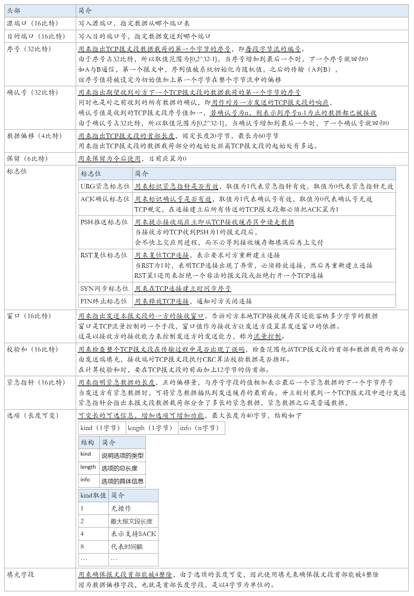

## 网络编程概括

（1）计算机网络是通过传输介质、通信设施和网络通信协议，把分散在不同地点的计算机设备互连起来的，实现资源共享和数据传输的系统。

（2）网络编程就是编写程序，使互联网的两个或多个设备（如计算机）之间进行数据传输。

（3）Java语言对网络编程提供了良好的支持，通过其提供的接口可以很方便地进行网络编程。

（4）Java提供的网络类库，可以实现无痛的网络连接，联网的底层细节被隐藏在 Java 的本机安装系统里，由 JVM 进行控制，并且 Java 实现了一个跨平台的网络库，程序员面对的是一个统一的网络编程环境。

 （5）实现网络中的主机互相通信的两点要素

| 要素         | 简介                                                        |
| ------------ | ----------------------------------------------------------- |
| 通信双方地址 | IP、端口号                                                  |
| 一定的规则   | 网络通信协议，有两套参考模型（OSI参考模型、TCP/IP参考模型） |


## 网络通信协议

### 网络通信协议简介

（1）计算机网络中实现通信必须有一些约定，即通信协议，通讯协议用来对速率、传输代码、代码结构、传输控制步骤、出错控制等制定标准

（2）计算机网络通信涉及内容很多，比如指定源地址和目标地址，加密解密，压缩 解压缩，差错控制，流量控制，路由控制，如何实现如此复杂的网络协议呢？

```java
通信协议分层的思想
1、分层可以避免一个协议太过于庞大和复杂
   在制定协议时，把复杂成份分解成一些简单的成份，再将它们复合起来。
2、分层之后协议之间解耦合，上层协议不需要理解下层协议的细节
   即同层间可以通信、上一层可以调用下一层，而与再下一层不发生关系。
3、各层互不影响，任意层次的协议的可以进行灵活的替换，利于系统的开发和扩展。
```

（3）国际标准化组织ISO为了使网络应用更为普及，推出了OSI参考模型，即开放式系统互联模型，一般都叫OSI参考模型。

```
OSI参考模型是ISO组织在1985年发布的网络互连模型，其含义就是为所有公司使用一个统一的规范来控制网络
这样所有公司遵循相同的通信规范，网络就能互联互通了
```

（4）由于OSI七层模型过于理想化，未能在因特网上进行广泛推广，实际是使用TCP/IP参考模型

| 模型           | 简介                                       |
| -------------- | ------------------------------------------ |
| OSI参考模型    | 模型过于理想化，未能在因特网上进行广泛推广 |
| TCP/IP参考模型 | TCP/IP协议，事实上的国际标准               |

（5）ISO七层模型、TCP/IP协议五层模型、TCP/IP协议四层模型之间的对应关系


### OSI七层参考模型

| 模型       | 功能                                                         |
| ---------- | ------------------------------------------------------------ |
| 应用层     | 为计算机用户提供服务，接收用户的数据，人机交互的接口，面向的应用程序 |
| 表示层     | 对应用程序的数据处理（编解码，加解密，压缩解压缩），规定数据的格式化表示，数据格式的转换等 |
| 会话层     | 管理应用程序之间的会话（建立、维护、重连、断开），规定通信时序 |
| 传输层     | 建立TCP或者UDP连接，为两个终端进程之间的通信提供通用数据传输服务 |
| 网络层     | 基于IP地址进行数据转发，路由和寻址（决定数据在网络中的游走路径） |
| 数据链路层 | 定义各段链路之间的通信协议，管理相邻节点直接的数据通信       |
| 物理层     | 利用传输介质为数据链路层提供支持，实现计算机节点之间比特流的透明传送 |

### TCP/IP五层参考模型

| 模型       | 功能                                                         |
| ---------- | ------------------------------------------------------------ |
| 应用层     | 为计算机用户提供服务，接收用户的数据，人机交互的接口，面向的应用程序 |
| 传输层     | 建立TCP或者UDP连接，为两个终端进程之间的通信提供通用数据传输服务 |
| 网络层     | 基于IP地址进行数据转发，路由和寻址（决定数据在网络中的游走路径） |
| 数据链路层 | 定义各段链路之间的通信协议，管理相邻节点直接的数据通信       |
| 物理层     | 利用传输介质为数据链路层提供支持，实现计算机节点之间比特流的透明传送 |

### TCP/IP四层参考模型

| 模型       | 功能                                                         |
| ---------- | ------------------------------------------------------------ |
| 应用层     | 为计算机用户提供服务，接收用户的数据，人机交互的接口，面向的应用程序 |
| 传输层     | 建立TCP或者UDP连接，为两个终端进程之间的通信提供通用数据传输服务 |
| 网络层     | 基于IP地址进行数据转发，路由和寻址（决定数据在网络中的游走路径） |
| 网络接口层 | 实现网卡接口的网络驱动，以处理数据在以太网线等物理媒介上的传输 |

## 传输层协议 TCP 和 UDP

### TCP 和 UDP简介

| 协议 | 简介                                                         |
| ---- | ------------------------------------------------------------ |
| TCP  | 传输控制协议，基于连接，传输数据稳定可靠，基于字节流的传输层通信协议，传输效率低<br>适用于对网络通讯质量要求较高，需要准确无误的传输给对方的场景，例如传输文件，发送邮件，浏览网页等等 |
| UDP  | 用户数据报协议，基于连接，传输数据可能产生丢包，传输效率高<br>适用于对实时性要求较高，但是对少量丢包并没有太大要求的场景，例如语音通话，视频直播等 |

### TCP和UDP对比

| 对比     | TCP传输控制协议                                    | UDP用户数据报协议            |
| -------- | -------------------------------------------------- | ---------------------------- |
| 连接方式 | 无连接                                             | 面向连接                     |
| 通信方式 | 支持单播（一对一）、多播（一对多）、广播（一对全） | 仅支持单播（一对一）         |
| 报文处理 | 对应用层交付的报文直接打包                         | 面向字节流                   |
| 是否可靠 | 不可靠，不使用流量控制和拥塞控制                   | 可靠，使用流量控制和拥塞控制 |
| 首部大小 | 仅8字节，首部开销小                                | 20~60字节                    |

## TCP传输控制协议

### TCP简介

（1）使用TCP协议进行数据通信，必须先经过`三次报文握手建立连接`，然后才能进行数据传输，传输结束后需要`四次报文挥手释放连接`

（2）TCP协议通信方式`仅支持单播`（一对一），因为每一条TCP连接只能有两个端点EP

（3）TCP协议对应用报文处理

```
为了实现可靠传输，TCP采用了面向字节流的方式，但TCP在发送数据时，
是从发送缓存取出一部分或全部字节，并给其添加一个首部使之成为TCP报文段后进行发送
```

（4）TCP协议向上层提供面向连接的可靠传输服务，适用于可靠传输的应用，例如文件传输


### TCP报文首部

一个TCP报文段由首部和数据载荷两部分构成，TCP的功能都体现在他首部中各字段的作用，TCP报文首部最小20字节，最大60字节





### TCP三次握手（建立连接）

#### 三次握手简介

（1）TCP是面向连接的，必须建立好连接之后才能传输数据，建立连接的过程就是三次握手，确认双方都能通信。

（2）三次握手（Three-way Handshake）其实就是指建立一个TCP连接时，需要客户端和服务器总共发送3个包，进行三次握手的主要作用就是为了确认双方的接收能力和发送能力是否正常、指定自己的初始化序列号为后面的可靠性传送做准备

（3）三次握手简单流程

| 握手   | 简介                                                         |
| ------ | ------------------------------------------------------------ |
| 第一次 | 客户端向服务端请求建立连接，此时服务器知道了客户端要建立连接了 |
| 第二次 | 服务端收应答客户端，同意建立连接，此时客户端知道服务器收到连接请求了 |
| 第三次 | 客户端收到服务端的应答，完成连接                             |

#### 三次握手详解


```
（1）我们将TCP建立连接的过程比喻成握手，握手需要在TCP客户端和服务器直接交换三个TCP报文段

（2）最初，客户端和服务器都处于关闭状态（CLOSE）

（3）然后，TCP服务器进程先创建传输控制块（TCB），用来存储TCP连接中的一些重要信息
	此时TCP服务器就进入了监听状态（LISTEN），时刻准备接受客户端进程的连接请求
	TCP服务器进程不是主动发起请求，而是被动等待来自TCP客户端进程的连接请求
	
（4）TCP客户端进程也是先创建传输控制块（TCB），然后向TCP服务器发出连接请求报文段，
	此时，TCP客户端（Client）进程进入了同步已发送状态（SYN-SENT）
	TCP连接建立是由TCP客户端主动发起的，被称为主动打开连接
	报文首部中的同步标志位SYN设置为1，用来在TCP连接建立时同步序号，表名这是一个连接请求
	报文首部中的序号字段seq设置为x，作为TCP客户进程所选择的初始序号
	TCP规定， SYN=1的报文段不能携带数据，但需要消耗掉一个序号

（5）TCP服务器进程收到SYN请求报文之后，如果同意连接则发出确认报文，会进入同步已接收状态（SYN-RCVD）
	报文首部中的同步标志位SYN和确认标志位ACK都设置为1，表明这是一个TCP连接请求确认报文段
	报文首部中的序号字段seq设置为y，作为TCP服务器进程所选择的初始序号
	报文首部中的确认标志位ACK设置为x+1，这是对TCP客户进程所选择的初始序号的确认
	 由于报文首部中的SYN=1，所以这个报文也不能携带数据，但是同样要消耗一个序号

（6）TCP客户端进程收到TCP服务器进程的确认报文段之后，
	首先会将自己的状态会从同步已发送状态（SYN-SENT）变成连接已建立（ESTABLISHED）
	还要向TCP服务器发送一个普通的TCP确认报文段，表示连接通道已经建立成功，可以发送数据了
	报文首部中的确认标志位ACK设置为1，表明这是一个普通的TCP确认报文段
	报文首部中的序号字段seq设置为x+1，因为TCP客户端进程发送的第一个TCP报文段的序号为x，并且不携带数据
	报文首部中的确认标志位ACK设置为y+1，这是TCP服务器进程所选择的初始序号的确认
	TCP规定，普通的TCP确认报文段可以携带数据，但如果不携带数据，则不消耗序号，此时发送的下一个数据报文序号仍为x+1

（7）TCP服务器进程收到确认报文段后，也进入已建立连接状态（ESTABLISHED）
	此时TCP双方都进入了连接已建立状态，可以基于已建立好的TCP连接，进行可靠的数据传输
```

#### 为什么是三次握手呢？而不是两次，四次？


```
（1）主要是为了防止已经失效的连接请求报文突然又传送到了服务器，从而产生错误。

（2）如果使用的是两次握手建立连接，假设有这样一种场景：
	客户端发送的第一个请求连接并且没有丢失，只是因为在网络中滞留的时间太长了，
	由于TCP的客户端迟迟没有收到确认报文，以为服务器没有收到，此时重新向服务器发送这条报文，
	此后客户端和服务器经过两次握手完成连接，传输数据，然后关闭连接。
	此时之前滞留的那一次请求连接，因为网络通畅了，到达了服务器，这个报文本该是失效的，
	但是，两次握手的机制将会让客户端和服务器再次建立连接，这将导致不必要的错误和资源的浪费。

（3）如果采用的是三次握手，就算是那一次失效的报文传送过来了，服务端接受到了那条失效报文并且回复了确认报文，
	但是客户端不会再次发出确认，由于服务器收不到确认，就知道客户端并没有请求连接。
```

### TCP四次挥手（断开连接）

#### 四次挥手简介

（1）TCP连接的释放也称为四次挥手，连接的释放必须是一方主动释放，另一方被动释放

（2）四次挥手简单流程

| 挥手   | 简介                                                         |
| ------ | ------------------------------------------------------------ |
| 第一次 | 客户端发送TCP报文给服务器端，请求断开连接，客户端进入`终止等待1状态`（FIN_WAIT_1） |
| 第二次 | 服务器端接收到从客户端发出的TCP报文后，确认了客户端想要释放连接，随后服务器端结束`连接已建立状态`（ESTABLISHED），进入`关闭等待状态`（CLOSE-WAIT）并返回一段TCP报文，客户端进程收到了TCP确认报文段后，由`终止等待1状态`（FIN_WAIT_1）转换成`终止等待2状态`（FIN_WAIT_2） |
| 第三次 | 服务器也打算断开连接，向客户端主动发送连接释放报文段，之后服务器进入`最后确认状态`（LAST_ACK），等待客户端的确认 |
| 第四次 | 客户端收连接释放报文段后，向服务器发送一个ACK应答报文段，之后客户端进入`时间等待状态`（TIME_WAIT）<br>服务器收到应答报文段后，服务器就进入`关闭状态`（CLOSE），到此服务器的连接已经完成关闭。<br>客户端处于`时间等待状态`（TIME_WAIT）时，此时的TCP还未释放掉，需要等待2MSL后，客户端才进入`关闭状态`（CLOSE），至此客户端也完成连接的关闭 |

#### 四次挥手详解


```
（1）第一次挥手：
	主动断开方（可以是客户端，也可以是服务器端），向对方发送TCP连接释放报文段，
	发送完成后，主动断开方进入终止等待1状态（FIN_WAIT_1），表示主动断开方没有业务数据要发送给对方，准备关闭SOCKET连接了
	报文首部中的终止标志位FIN设置为1，通知对方关闭连接
	报文首部中的确认标志位ACK设置为v，v等于TCP客户进程之前已收到的数据的最后一个字节的序号加1
	报文首部中的序号字段seq设置为u，u等于TCP客户进程之前已经传送过的数据的最后一个字节的序号加1
	TCP规定， FIN=1的报文段即使不携带数据，也要消耗掉一个序号

（2）第二次挥手：
	正常情况下，在收到了主动断开方发送的断开请求报文后，
	被动断开方会发送一个普通的TCP确认报文段，并结束连接已建立状态（ESTABLISHED）进入关闭等待状态（CLOSE-WAIT）
	报文首部中的确认标志位ACK设置为1，表明这是一个普通的TCP确认报文段
	报文首部中的序号字段seq设置为v，u等于TCP服务器进程之前已经传送过的数据的最后一个字节的序号加1
	报文首部中的确认标志位ack设置为u+1，这是对TCP连接释放报文段的确认
	
	TCP服务器通知高层的应用进程，客户端向服务器的方向就释放了，
	这时候处于半关闭状态，即客户端已经没有数据要发送了，但是服务器若发送数据，客户端依然要接受。
	这个状态还要持续一段时间，也就是整个关闭等待状态（CLOSE-WAIT）持续的时间。
	主动断开方在收到了TCP确认报文段后，由终止等待1状态（FIN_WAIT_1）转换成终止等待2状态（FIN_WAIT_2）
	
（3）第三次挥手：
	在发送完成报文后，被动断开方还可以继续完成业务数据的发送，
	待剩余数据发送完成后，或者关闭等待状态（CLOSE-WAIT）截止后，
	被动断开方会向主动断开方发送一个TCP连接释放报文段，表示被动断开方的数据都发送完了，
	然后被动断开方进入最后确认状态（LAST_ACK）。
	报文首部中的确认标志位ACK和终止标志位FIN都设置为1，表明这是一个TCP连接释放报文段，同时对之前收到的报文段进行确认
	报文首部中的序号字段seq设置为w，因为TCP在半关闭状态下，可能又发送了一些数据
	报文首部中的确认标志位ack设置为u+1，这是对之前收到的TCP连接释放报文段的重复确认

（4）第四次挥手：
	主动断开方收在到断开响应报文后，还需要进行最后的确认，向被动断开方发送一个普通的确认报文，
	然后，自己就进入时间等待状态（TIME_WAIT），等待超时后最终关闭连接。
	被动断开方在收到主动断开方的最后的报文以后，最终关闭了连接，进入关闭状态（CLOSE）自己什么也不管了。
	处于时间等待状态（TIME_WAIT）的主动断开方，在等待完成2MSL的时间后，
	如果期间没有收到其他报文，则证明对方已正常关闭，主动断开方的连接最终关闭，也进入关闭状态（CLOSE）。
	报文首部中的确认标志位ACK设置为1，表明这是一个普通的TCP确认报文段
	报文首部中的序号字段seq设置为u+1，这是因为之前发送的TCP连接释放报文段虽然不携带数据，但需要消耗一个序号
	报文首部中的确认标志位ack设置为w+1，这是对所收到的TCP连接释放报文段的确认
	MSL意思为最长报文段寿命，RFC793建议为2分钟，
	但对于现在的网络，两分钟时间太长了，因此TCP允许不同的实现可以根据具体情况使用更小的MSL值
```

#### 为什么关闭连接的需要四次挥手，而建立连接却只要三次握手呢？

```
（1）建立连接时，被动方服务器端结束CLOSED阶段进入“握手”阶段并不需要任何准备，可以直接返回SYN和ACK报文，开始建立连接。

（2）释放连接时，被动方服务器，突然收到主动方客户端释放连接的请求时并不能立即释放连接，
	因为还有必要的数据需要处理，所以服务器先返回ACK确认收到报文，
	经过CLOSE-WAIT阶段准备好释放连接之后，才能返回FIN释放连接报文。
```

#### 为什么主动断开方在时间等待状态（TIME_WAIT）必须等待2MSL的时间？


原因之一：主动断开方等待2MSL的时间，是为了确保两端都能最终关闭。

```
（1）假设网络是不可靠的，被动断开方发送报文后，其主动方的响应报文有可能丢失
	
（2）如果主动断开方在发送完响应报文后，不是进入时间等待状态（TIME_WAIT）去等待2MSL时间，而是立即释放连接，
	则将无法收到被动方重传的报文，所以不会再发送一次确认报文，
	此时处于最后确认状态（LAST_ACK）的被动断开方，无法正常进入到关闭状态（CLOSE），
	在这种场景下，被动断开方会超时重传断开响应报文

（3）如果主动断开方在2MSL时间内，收到这个重传的报文，会重传一次报文后再一次重新启动2MSL计时等待，
	这样，就能确保被动断开方能收到ACK报文，从而能确保被动方顺利进入到CLOSED状态。
	只有这样，双方都能够确保关闭
```

原因之二：防止“旧连接的已失效的数据报文”出现在新连接中。

```
（1）主动断开方在发送完最后一个ACK报文后，再经过2MSL才能最终关闭和释放端口，
	这就意味着相同端口的新TCP新连接，需要在2MSL的时间之后，才能够正常的建立。

（2）2MSL这段时间内，旧连接所产生的所有数据报文，都已经从网络中消失了，
	从而确保了下一个新的连接中不会出现这种旧连接请求报文。
```

 

#### 如果已经建立了连接，但是客户端突然出现故障了怎么办？

TCP还设有一个`保活计时器`，客户端端如果出现故障，服务端不能一直等下去，这样会浪费系统资源。

```
（1）TCP服务器进程每收到一次TCP客户进程的数据，就重新设置并启动保活计时器，通常设置为2小时。
	如果觉得保活计时器的两个多小时的间隔太长，可以自行调整TCP连接的保活参数。
	
（2）若2小时还没有收到客户进程的任何数据（超时），TCP服务端就会发送一个探测报文段，以后每隔75秒钟发送一次。
	
（3）若一连发送10个探测报文仍然没反应，服务端就认为客户端出了故障，接着就关闭连接。
```


## UDP用户数据报协议

（1）使用UDP协议进行数据通信，可以随时发送数据

（2）UDP协议通信方式支持单播（一对一）、多播（一对多）、广播（一对全）

（3）UDP协议对应用报文处理

```
发送方的应用进程将应用层报文交付给运输层的UDP，
UDP直接给应用层报文添加一个UDP首部，使之成为UDP用户数据报，然后进行发送
接收方的UDP收到该UDP用户数据报后，去掉UDP首部，将应用层报文交付为应用进程
```

（4）UDP协议向上层提供无连接不可靠传输服务，适用于IP电话，视频会议等实时应用


## 应用层协议HPPT 

### HTTP协议简介

（1）HTTP协议是超文本传输协议（Hyper Text Transfer Protocol），是用于从万维网服务器传输超文本到本地浏览器的传送协议。

（2）Http协议作用：确定了请求和响应数据的格式

（3）HTTP和HTTPS都是应用层协议，应用层协议大多都需要手动指定，HTTP协议是基于TCP/IP协议来实现的。

（4）HTTP默认端口号为80，HTTPS默认端口号是443

（5）HTTP是无连接的，无连接的含义是限制每次连接只处理一个请求，服务器处理完客户的请求，并收到客户的应答后，即断开连接，采用这种方式可以节省传输时间

（6）HTTP允许传输任意类型的数据对象，正在传输的类型由Content-Type加以标记

### HTTP协议的请求

客户端给服务器发送数据，叫Request请求，HTTP请求数据总共分为三部分内容，分别是请求行、请求头、请求体

| 请求   | 简介                                                         |
| ------ | ------------------------------------------------------------ |
| 请求行 | 由请求的方式、请求的URL、请求的协议（一般都是HTTP1.1）三部分组成，使用空格隔开 |
| 请求头 | 请求头部用来描述客户端的基本信息，从而把客户端相关的信息告知服务器（key:value形式） |
| 请求体 | 请求体中存放提交到服务器的数据，只有POST请求才有请求体，GET请求没有请求体 |

#### 请求行

（1）常见请求方式

| 请求方式 | 简介                     |
| -------- | ------------------------ |
| GET      | 从服务器端获取数据       |
| POST     | 将数据保存到服务器端     |
| PUT      | 命令服务器对数据执行更新 |
| DELETE   | 命令服务器删除数据       |
| 其他     | 其他请求方式             |

（2）URL(Uniform Resource Locator)：统一资源定位符，表示互联网（Internet）上某一资源的地址。

```
https://www.baidu.com/index?name=tom
```

| 协议       | 主机名（IP）                          | 端口号 | 路径  | 参数     | 锚点 |
| ---------- | ------------------------------------- | ------ | ----- | -------- | ---- |
| http/https | [www.baidu.com](http://www.baidu.com) | 80/443 | index | name=tom | #    |

IP地址用于标识网络上的一台计算机的位置，共32位，4个8位二进制数组成，分为：IPv4和IPv6

| IP地址 | 简介                               |
| ------ | ---------------------------------- |
| IPv4   | 点分十进制表示法，2011年初已经用尽 |
| IPv6   | 十六进制表示法，新一代互联网的协议 |

端口号用来区分是主机上的那个应用，标识正在计算机上运行的进程，不同的进程有不同的端口号，被规定为一个 16 位的整数 0~65535

| 分类          | 简介                                                         |
| ------------- | ------------------------------------------------------------ |
| 公认端口      | 0~1023。被预先定义的服务通信占用  如：HTTP占用端口  80，FTP占用端口21，Telnet占用端口23 |
| 注册端口      | 1024~49151。分配给用户进程或应用程序。  如：Tomcat占  用端口8080，MySQL占用端口3306，Oracle占用端口1521等 |
| 动态/私有端口 | 49152~65535                                                  |

（3）请求的协议一般都是HTTP1.1

| 请求协议 | 简介                                                         |
| -------- | ------------------------------------------------------------ |
| HTTP0.9  | 只有基本的文本GET功能                                        |
| HTTP1.0  | 定义了三种请求方法： GET, POST 和 HEAD方法                   |
| HTTP1.1  | 新增了五种请求方法：OPTIONS, PUT, DELETE, TRACE 和 CONNECT 方法 |
| HTTP2.0  | 未普及，请求/响应首部的定义基本没有改变，只是所有首部键必须全部小写，而且请求行要独立为:method、:scheme、:host、 :path 等键值对 |

#### 请求头

| 请求头                    | 简介                                                         |
| ------------------------- | ------------------------------------------------------------ |
| Host                      | 用来说明主机和端口号                                         |
| Connection                | 表示客户端与服务器的连接类型                                 |
| Upgrade-Insecure-Requests | 表示升级不安全的请求，会在加载HTTP资源时自动替换成HTTPS请求，让浏览器不再显示HTTPS页面中的HTTP请求警报 |
| User-Agent                | 用来说明当前是什么类型的浏览器                               |
| Content-Type              | 用来描述发送到服务器的数据格式                               |
| Accept                    | 用来描述客户端能够接受什么类型的返回内容                     |
| Accept-Language           | 指出浏览器可以接受的语言种类                                 |
| Accepl-Charset            | 指出浏览器可以接受的字符编码                                 |
| Referer                   | 页面跳转来源，表明产生请求的网页来自于哪个URL                |
| Accept-Encoding           | 指出浏览器可以接受的编码方式                                 |
| Cookie                    | 记载和服务器相关的用户信息                                   |
| Conten-Type               | 指定POST请求中用来表示的内容类型                             |

其中Content-Type用来描述发送到服务器的数据格式，常见的如下

| 常见Content-Type                          | 简介            |
| ----------------------------------------- | --------------- |
| text/html                                 | HTML格式        |
| text/css                                  | CSS格式         |
| text/javascript    application/javascript | JavaScript 格式 |
| text/json    application/json             | JSON数据格式    |
| text/plain                                | 纯文本格式      |
| text/xml                                  | XML格式         |
| image/gif                                 | gif图片格式     |
| image/jpeg                                | jpg图片格式     |
| image/png                                 | png图片格式     |

#### 请求体

请求体中存放提交到服务器的数据，只有POST请求才有请求体，GET请求没有请求体 

### HTTP协议的响应

响应消息就是服务器响应给客户端的消息内容， 也叫做响应报文，主要由响应行、响应头部和响应体4个部分组成 

| 响应   | 简介                                                         |
| ------ | ------------------------------------------------------------ |
| 响应行 | 由HTTP协议 、状态码、状态码的描述文本3个部分组成，使用空格隔开 |
| 响应头 | 用来描述服务器的基本信息，响应头部由多行键值对构成，每行的键和值之间用英文的冒号分隔。 |
| 响应体 | 服务器返回的数据主体，有可能是各种数据类型  比如：html、css、js、图片、视频等等 |

#### 响应行

格式：HTTP/1.1 200 OK

#### 响应头

|                     |                                                              |
| ------------------- | ------------------------------------------------------------ |
| Connection          | 响应完是保持链接还是关闭链接                                 |
| Content-Encoding    | 告诉浏览器数据采用的压缩格式                                 |
| Content-Type        | 回送数据的类型                                               |
| Date                | 返回响应的时间                                               |
| Server              | 告诉浏览器服务器的类型                                       |
| Transfer-Encoding   | 告诉浏览器数据的传送格式                                     |
| vary                | 用于列出一个响应字段列表，告诉缓存服务器遇到同一个 URL 对应着不同版本文档的情况时，如何缓存和筛选合适的版本 |
| Location            | 配合302状态码使用，告诉用户端找谁                            |
| Content-Length      | 告诉浏览器回送数据的长度                                     |
| Content-Language    | 告诉服务器的语言环境                                         |
| Last-Modified       | 告诉浏览器当前资源的缓存时间                                 |
| Refresh             | 告诉浏览器隔多长时间刷新一次                                 |
| Content-Disposition | 告诉浏览器以下载的方式打开数据                               |
| ETag                | 与缓存相关的头                                               |

#### 响应体

服务器返回的数据主体，有可能是各种数据类型  比如：html、css、js、图片、视频等等 

### 状态码

#### 状态码简介

（1）HTTP 响应码，也称 HTTP 状态码（HTTP Status Code），反映了 web 服务器处理 HTTP 请求状态

（2）每一个响应码都代表了一种服务端反馈的响应状态，标识了本次请求是否成功。

#### 状态码分类

HTTP 响应码通常分为五大类

| 状态码 | 分类                                                         |
| ------ | ------------------------------------------------------------ |
| 1XX    | 信息类（Information），表示收到  http 请求，正在进行下一步处理，通常是一种瞬间的响应状态 |
| 2XX    | 成功类（Successful），表示用户请求被正确接收、理解和处理     |
| 3XX    | 重定向类（Redirection），表示没有请求成功，必须采取进一步的动作 |
| 4XX    | 客户端错误（Client  Error），表示客户端提交的请求包含语法错误或不能正确执行 |
| 5XX    | 服务端错误（Server  Error），表示服务器不能正确执行一个正确的请求  客户端请求的方法及参数是正确的，服务端不能正确执行，如网络超时、服务僵死，可以查看服务端日志再进一步解决 |

#### 常见状态码

| 状态码    | 简介                                                         |
| --------- | ------------------------------------------------------------ |
| 200       | OK，请求成功。一般用于 GET 与  POST 请求                     |
| 201       | Created，已创建。成功请求并创建了新的资源                    |
| 202       | Accepted，接受                                               |
| 301       | Moved  Permanently，永久性重定向，资源被永久移动  请求的资源已被永久的移动到新  URI，返回信息会包括新的 URI，  浏览器会自动定向到新  URI，今后任何新的请求都应使用新的 URI |
| 302       | Found，临时性重定向，资源临时移动。资源只是临时被移动，客户端应继续使用原有  URI |
| 304       | 服务端已经执行了GET，但文件未变化，用其他策略获取资源        |
| 400       | Bad  Requests，服务器认为客户端出现了错误，但不能明确判断为哪种错误，例如HTTP请求格式错误。（请求不合法） |
| 401       | Unauthorized，用户未授权，或认证失败。对于需要登录的网页，服务器可能返回此响应 |
| 403       | Forbidden，没权限，服务器收到请求，但拒绝提供服务            |
| 404       | Not Found，找不到资源，请求的资源不存在。遇到 404 首先检查请求 url  是否正确 |
| 405       | Method  Not Allowed，当前请求的方法不支持，比如提交了post请求，但是没有出来post请求的方法 |
| 406       | Not  Acceptable，对客户端指定的资源表述不存在（例如对语言或者编码有要求），服务器返回表述列表供客户端选择。 |
| 407       | Proxy Authentication  Required，对需要经由代理的请求，认证信息未通过代理服务器的验证 |
| 408       | Request  Timeout，服务器接收请求超时                         |
| 409       | Conflict，资源冲突，例如上传文件时目标位置已经存在版本更新的资源 |
| 410       | Gone，服务器没有找到对应的资源，且明确的知道该位置永久性找不到该资源 |
| 411       | Length  Required，如果请求含有包体且未携带 Content-Length 头部，且不属于chunk类请求时，返回 411 |
| 412       | Precondition  Failed，复用缓存时传递的 If-Unmodified-Since 或 If-None-Match 头部不被满足 |
| 413       | Payload Too  Large/Request Entity Too Large，请求的包体超出服务器能处理的最大长度 |
| 414       | URI Too Long，请求的 URI  超出服务器能接受的最大长度         |
| 415       | Unsupported Media  Type，上传的文件类型不被服务器支持        |
| 416       | Range Not  Satisfiable，无法提供 Range 请求中指定的那段包体  |
| 417       | Expectation Failed，对于  Expect 请求头部期待的情况无法满足时的响应码 |
| 421       | Misdirected  Request，服务器认为这个请求不该发给它，因为它没有能力处理。 |
| 426       | Upgrade  Required，服务器拒绝基于当前 HTTP 协议提供服务，通过  Upgrade，头部告知客户端必须升级协议才能继续处理 |
| 428       | Precondition  Required，用户请求中缺失了条件类头部，例如 If-Match |
| 429       | Too Many  Requests，客户端发送请求的速率过快                 |
| 431       | Request Header Fields  Too Large，请求的 HEADER 头部大小超过限制 |
| 451       | Unavailable For Legal  Reasons，RFC7725 ，由于法律原因资源不可访问 |
| 500       | Internal  Server Error，服务器内部错误，无法完成请求，说明代码有bug |
| 501       | Not  Implemented，服务器不支持实现请求所需要的功能（当前请求的功能还没有去实现，需要服务器去升级或者添加相应的功能） |
| 502       | 代理服务器无法获取到合法响应                                 |
| 503       | Service  Unavailable，服务器资源尚未准备好处理当前请求  可能由于超载或系统维护（一般是访问人数过多），服务器无法处理客户端的请求  ，通常这只是暂时状态 |
| 504       | Gateway  Timeout，代理服务器无法及时的从上游获得响应（表示代理服务器和源服务器之间出现了超时） |
| 505       | HTTP Version Not  Supported，请求使用的 HTTP 协议版本不支持  |
| 507       | Insufficient  Storage，服务器没有足够的空间处理请求          |
| 508       | Loop  Detected，访问资源时检测到循环                         |
| 511       | Network  Authentication Required：代理服务器发现客户端需要进行身份验证才能获得网络访问权限 |
| not found | 请求无法完成                                                 |

## InetAddress类

### InetAddress类简介

（1）在Java中，InetAddress类是用于管理Ip的类，使用InetAddress类的对象来表示主机的IP地址，该对象中也包含了一系列关于IP地址和域名的相关操作方法

（2）InetAddress类没有提供公共的构造器，而是提供了静态方法来返回InetAddress实例

### InetAddress类中的方法

| 方法                                                       | 简介                                                         |
| ---------------------------------------------------------- | ------------------------------------------------------------ |
| equals(Object obj)                                         | 将此对象与指定对象比较。                                     |
| getAddress()                                               | 返回此 InetAddress 对象的原始  IP 地址。                     |
| getAllByName(String host)                                  | 在给定主机名的情况下，根据系统上配置的名称服务返回其  IP 地址所组成的数组。 |
| getByAddress(byte[] addr)                                  | 在给定原始  IP 地址的情况下，返回 InetAddress 对象。         |
| getByAddress(String host,  byte[] addr)                    | 根据提供的主机名和  IP 地址创建 InetAddress。                |
| `getByName(String host)`                                   | 在给定主机名的情况下确定主机的  IP 地址。                    |
| getCanonicalHostName()                                     | 获取此 IP  地址的完全限定域名。                              |
| `getHostAddress()`                                         | 返回 IP  地址字符串（以文本表现形式）。                      |
| `getHostName()`                                            | 获取此 IP  地址的主机名。                                    |
| `getLocalHost()`                                           | 返回本地主机。                                               |
| hashCode()                                                 | 返回此 IP  地址的哈希码。                                    |
| isAnyLocalAddress()                                        | 检查  InetAddress 是否是通配符地址的实用例行程序。           |
| isLinkLocalAddress()                                       | 检查  InetAddress 是否是链接本地地址的实用例行程序           |
| isLoopbackAddress()                                        | 检查  InetAddress 是否是回送地址的实用例行程序。             |
| isMCGlobal()                                               | 检查多播地址是否具有全局域的实用例行程序。                   |
| isMCLinkLocal()                                            | 检查多播地址是否具有链接范围的实用例行程序。                 |
| isMCNodeLocal()                                            | 检查多播地址是否具有节点范围的实用例行程序。                 |
| isMCOrgLocal()                                             | 检查多播地址是否具有组织范围的实用例行程序。                 |
| isMCSiteLocal()                                            | 检查多播地址是否具有站点范围的实用例行程序。                 |
| isMulticastAddress()                                       | 检查  InetAddress 是否是 IP 多播地址的实用例行程序。         |
| `isReachable(int timeout)`                                 | 测试是否可以达到该地址。                                     |
| isReachable(NetworkInterface netif,  int ttl, int timeout) | 测试是否可以达到该地址。                                     |
| isSiteLocalAddress()                                       | 检查  InetAddress 是否是站点本地地址的实用例行程序。         |
| toString()                                                 | 将此 IP  地址转换为 String                                   |

### InetAddress类中方法使用

```java
public class Demo {
    public static void main(String[] args) throws UnknownHostException {
        // getByName(String host):在给定主机名的情况下确定主机的IP地址
        InetAddress ip1 = InetAddress.getByName("192.168.10.10");//ip
        System.out.println(ip1);// /192.168.10.10

        // 根据域名获取ip
        InetAddress ip2 = InetAddress.getByName("www.baidu.com");//域名
        System.out.println(ip2);//www.baidu.com/182.61.200.7

        // 获取本机ip
        InetAddress localhost = InetAddress.getByName("localhost");
        System.out.println(localhost);//localhost/127.0.0.1

        // getLocalHost():返回本地主机
        InetAddress localHost = InetAddress.getLocalHost();
        System.out.println(localHost);//LAPTOP-U6SJ0UST/169.254.19.111

        //getHostName()：获取域名
        System.out.println(localHost.getHostName());//LAPTOP-U6SJ0UST

        //getHostAddress()：获取主机地址
        System.out.println(localHost.getHostAddress());//169.254.19.111
    }
}
```


## Socket编程

### Scoket简介

（1）端口号与IP地址的组合得出一个网络套接字Socket

（2）套接字（Socket）是计算机之间通信的一种协议，用来实现网络编程，利用Socket能比较方便的实现客户端（server）和服务器（cilent）的网络通信

（3）套接字（Socket）本质是一组编程接口API，基于TCP、UDP]等协议做的一层封装，是一套系统所提供的的用于进行网络通信的编程接口，在Java中，有专门的Socket类来处理用户请求和响应，学习使用Socket类方法，就可以实现两台机器之间通信。

（4）Java中的网络通信时通过Socket实现的，Socket分为ServerSocket和Socket两大类

| 分类         | 简介                                                         |
| ------------ | ------------------------------------------------------------ |
| ServerSocket | 用于服务器端，可以通过accept方法监听请求，监听请求后返回Socket |
| Socket       | 建立网络连接时使用，用于完成具体数据传输，客户端也可以使用Socket发起请求并传输数据 |

### Socket类

java.net.Socket类为客户端的通信套接字，可以指定远端IP地址和端口号进行连接通信，也可以通过方法获得已连接的Socket的远端ip地址和端口，还可以将此socket以字节输入流和输出流的形式返回，当与数据输入流和输出流绑定，便可以实现客户端的网络通信。

#### 构造方法

构造方法会尝试和服务器建立连接，如果连接成功，就返回socket对象，失败就会抛出IOException

| 方法                                                         | 简介                                                         |
| ------------------------------------------------------------ | ------------------------------------------------------------ |
| Socket(InetAddress address , int port )                      | 创建一个socket 并与指定的IP地址的端口相连接。address指定ip、port指定端口 |
| Socket(String host , int port )                              | 创建一个socket并与指定主机的指定端口相连接。Host指定主机的字符串名；port指定端口 |
| Socket(InetAddress address, int port, InetAddress localAddr, int localPort) | address指定服务器端地址、port指定服务器的端口号<br>localAddr指定本机的地址、localPort指定本机的端口号 |

#### 常用方法

| 方法                                         | 简介                                                         |
| -------------------------------------------- | ------------------------------------------------------------ |
| connect(SocketAddress endpoint, int timeout) | 设置超时时间，默认Socket连接会一直等下去，直到连接成功，或者出现异常 |
| getInetAddress()                             | 获得远程服务器的IP地址                                       |
| getPort()                                    | 获得远程服务器的端口                                         |
| getLocalAddress()                            | 获得客户本地的IP地址                                         |
| getLocalPort()                               | 获得客户本地的端口                                           |
| InputStream getInputStream();                | 返回输入流，如果Socket还没有连接，或者已经关闭会抛出IOException |
| OutputStream getOutputStream();              | 返回输出流，如果Socket还没有连接，或者已经关闭会抛出IOException |
| shutdownInput()                              | 关闭输入流                                                   |
| shutdownOutput()                             | 关闭输出流                                                   |
| isClosed()                                   | 是否关闭，关闭了返回true，否则返回false                      |
| isConnected()                                | 如果socket曾经连接远程主机，不管当前是否关闭，都返回true。如果从未连接到远程主机，返回false |
| isBound()                                    | 如果socket与一个本地端口绑定，则返回true，否则返回false      |

#### 设置Socket选项

| 设置选项                       | 简介                                                         |
| ------------------------------ | ------------------------------------------------------------ |
| setTcpNoDelay(true);           | 表示是否立即发送数据。默认是false，不会立即发送数据          |
| setReuseAddress(true);         | 表示是否允许重用Socket所绑定的本地地址。                     |
| setSoTimeout(1000);            | 表示接收数据时的等待超时时间                                 |
| setSoLinger(true,3600);        | 用来控制Socket关闭时的行为，表示当执行Socket的close()方法时，是否立即关闭底层的Socket。默认情况下，执行close方法，该方法会立即返回，但是底层的socket实际上不会立即关闭，会延迟一段时间，直到发送完剩下的数据，才会真正关闭 |
| setReceiveBufferSize(int size) | 表示发送数据的缓冲区的大小                                   |
| setSendBufferSize(int size)    | 表示接收数据的缓冲区的大小，                                 |
| setKeepAlive(boolean on)       | 表示对于长时间处于空闲状态的Socket，是否要自动把它关闭，默认值为false，表示TCP不会监视连接是否有效，不活动的客户端可能会永久存在下去，而不会注意到服务器已经崩溃 |


### ServerSocket 类

ServerSocket类是服务器的通信套接字，用来侦听客户端的请求连接，并为每个连接创建一个Socket对象，由此创建绑定此Scoket的输入流和输出流，与客户端实现网络通信。

#### 构造方法

| 构造方法                                                  | 简介                                                        |
| --------------------------------------------------------- | ----------------------------------------------------------- |
| ServerSocket(int port );                                  | 如果端口号为0，则在任意的空闲端口创建一个服务器套接字       |
| ServerSocket(int port ,int backlog) ;                     | port指定端口、backlog指定最大的连接数量                     |
| ServerSocket(int port, int backlog, InetAddress bindAddr) | port指定端口、backlog指定最大的连接数量、bindAddr指定IP地址 |

#### 常用方法

| 方法             | 简介                                                         |
| ---------------- | ------------------------------------------------------------ |
| accept()         | 接收客户端的Socket连接请求，如果没有接收到客户端的Socket请求，将一直处于等待状态，从而线程阻塞 |
| getInetAddress() | 返回当前ServerSocket对象的地址信息                           |
| getLocalPort()   | 返回当前ServerSocket对象的服务端口                           |
| close()          | 关闭当前的ServerSocket                                       |


### TCP网络编程（面向字节流）

#### 案例一

客户端发送内容给服务端，服务端收到消息将内容打印到控制台上

```java
/**
 * 先启动服务端，等待接收来自客户端的消息
 * 然后启动客户端，发送内容给服务端
 * 服务端收到消息，将内容打印到控制台上
 */
public class Demo {
    /**
     * 客户端：发送内容给服务端
     */
    @Test
    public void client() {
        Socket socket = null;
        OutputStream outputStream = null;
        try {
            //（1）创建Socket对象，指明服务器端的ip和端口号
            System.out.println("等待连接服务端...");
            Thread.sleep(1000);
            socket = new Socket("127.0.0.1", 8899);
            System.out.println("连接服务端成功！");
            //（2）获取一个输出流，用于输出数据
            outputStream = socket.getOutputStream();

            //（3）写出数据的操作
            outputStream.write("你好，我是客户端".getBytes());
        } catch (IOException e) {
            e.printStackTrace();
        } catch (InterruptedException e) {
            e.printStackTrace();
        } finally {
            //（4）资源的关闭
            if (outputStream != null) {
                try {
                    outputStream.close();
                } catch (IOException e) {
                    e.printStackTrace();
                }
            }
            if (socket != null) {
                try {
                    socket.close();
                } catch (IOException e) {
                    e.printStackTrace();
                }
            }
        }
    }

    /**
     * 服务端：将内容打印到控制台上
     */
    @Test
    public void server() {
        ServerSocket serverSocket = null;
        Socket accept = null;
        InputStream inputStream = null;
        ByteArrayOutputStream byteArrayOutputStream = null;
        try {
            //（1）创建服务器端的ServerSocket对象，指明自己的端口号
            serverSocket = new ServerSocket(8899);

            //（2）调用accept()方法，表示可以接受来自客户端的Socket
            System.out.println("等待连接...");
            accept = serverSocket.accept();
            System.out.println("连接成功！");

            //（3）获取输入流
            inputStream = accept.getInputStream();

            //（4）读取输入流中的数据
            byteArrayOutputStream = new ByteArrayOutputStream();
            byte[] b = new byte[20];
            int num;
            while ((num = inputStream.read(b)) != -1) {
                byteArrayOutputStream.write(b, 0, num);
            }
            System.out.println(byteArrayOutputStream.toString());
            System.out.println("收到来自于：" + serverSocket.getInetAddress().getHostAddress() + "的数据");
        } catch (IOException e) {
            e.printStackTrace();
        } finally {
            //（5）资源的关闭
            if (byteArrayOutputStream != null) {
                try {
                    byteArrayOutputStream.close();
                } catch (IOException e) {
                    e.printStackTrace();
                }
            }
            if (inputStream != null) {
                try {
                    inputStream.close();
                } catch (IOException e) {
                    e.printStackTrace();
                }
            }
            if (accept != null) {
                try {
                    accept.close();
                } catch (IOException e) {
                    e.printStackTrace();
                }
            }
            if (serverSocket != null) {
                try {
                    serverSocket.close();
                } catch (IOException e) {
                    e.printStackTrace();
                }
            }
        }
    }
}
```

#### 案例二

客户端发送文件给服务端，服务端接收文件并保存到本地

```java
/**
 * 先启动服务端，等待接收来自客户端的消息
 * 然后启动客户端，客户端发送文件给服务端
 * 服务端接收到文件，保存文件到本地
 * 注意：实际需要使用try-catch处理异常
 */
public class Demo {
    /**
     * 客户端：发送文件给服务端
     */
    @Test
    public void client() throws IOException, InterruptedException {
        //（1）创建Socket对象，指明服务器端的ip和端口号
        System.out.println("等待连接服务端...");
        Thread.sleep(1000);
        Socket socket = new Socket("127.0.0.1", 8899);
        System.out.println("连接服务端成功！");

        //（2）获取一个输出流，用于输出数据
        System.out.println("开始发送文件...");
        Thread.sleep(1000);
        // 获取一个输出流，用于输出数据
        OutputStream outputStream = socket.getOutputStream();

        //（3）获取输入流，读数据
        FileInputStream fileInputStream = new FileInputStream(new File("hello.txt"));

        //（4）读写过程
        byte[] b = new byte[3];
        int num;//记录每次读入到数组的个数
        while ((num = fileInputStream.read(b)) != -1) {
            outputStream.write(b, 0, num);
        }
        System.out.println("文件发送完毕！");

        //（5）资源的关闭
        fileInputStream.close();
        outputStream.close();
        socket.close();
    }

    /**
     * 服务端：接收文件，保存文件到本地
     */
    @Test
    public void server() throws IOException {
        //（1）创建服务器端的ServerSocket对象，指明自己的端口号
        ServerSocket serverSocket = new ServerSocket(8899);

        //（2）调用accept()方法，表示可以接受来自客户端的Socket
        System.out.println("等待连接...");
        Socket accept = serverSocket.accept();
        System.out.println("连接成功！");

        //（3）获取输入流
        System.out.println("开始接收文件...");
        InputStream inputStream = accept.getInputStream();
        System.out.println("接收成功！");
        System.out.println("收到来自于：" + serverSocket.getInetAddress().getHostAddress() + "的数据");

        //（4）获取输出流，写数据
        System.out.println("开始写入文件...");
        FileOutputStream fileOutputStream = new FileOutputStream(new File("test.txt"));

        //（5）读取输入流中的数据
        byte[] b = new byte[20];
        int num;
        while ((num = inputStream.read(b)) != -1) {
            fileOutputStream.write(b, 0, num);
        }
        System.out.println(inputStream.toString());
        System.out.println("写入成功！");

        //（6）资源的关闭
        fileOutputStream.close();
        inputStream.close();
        accept.close();
        serverSocket.close();
    }
}
```

#### 案例三

客户端发送文件给服务端，服务端接收文件保存本地，并响应提示信息

```java
/**
 * 先启动服务端，等待接收来自客户端的消息
 * 然后启动客户端，客户端发送文件给服务端
 * 服务端接收到文件，保存文件到本地
 * 保存文件成功后，返回提示信息给客户端，并关闭相应的连接。
 * 注意：实际需要使用try-catch处理异常
 */
public class Demo {
    /**
     * 客户端：发送文件给服务端
     */
    @Test
    public void client() throws IOException, InterruptedException {
        //（1）创建Socket对象，指明服务器端的ip和端口号
        System.out.println("等待连接服务端...");
        Thread.sleep(1000);
        Socket socket = new Socket("127.0.0.1", 8899);
        System.out.println("连接服务端成功！");

        //（2）获取一个输出流，用于输出数据
        System.out.println("开始发送文件...");
        Thread.sleep(1000);
        OutputStream outputStream = socket.getOutputStream();

        //（3）获取输入流，读数据
        FileInputStream fileInputStream = new FileInputStream(new File("hello.txt"));

        //（4）读写过程
        byte[] b = new byte[3];
        int num;//记录每次读入到数组的个数
        while ((num = fileInputStream.read(b)) != -1) {
            outputStream.write(b, 0, num);
        }
        // 关闭数据的输出(如果不关闭，服务端不知道什么时候传完，导致程序阻塞)
        socket.shutdownOutput();
        System.out.println("文件发送完毕！");

        //（5）接收来自服务器端的数据，并显示到控制台
        InputStream inputStream = socket.getInputStream();
        ByteArrayOutputStream byteArrayOutputStream = new ByteArrayOutputStream();
        byte[] bytes = new byte[3];
        int len;
        while ((len = inputStream.read(bytes)) != -1) {
            byteArrayOutputStream.write(bytes, 0, len);
        }
        System.out.println(byteArrayOutputStream.toString());

        //（6）资源的关闭
        byteArrayOutputStream.close();
        inputStream.close();
        fileInputStream.close();
        outputStream.close();
        socket.close();
    }

    /**
     * 服务端：接收文件，保存文件到本地，响应提示信息
     */
    @Test
    public void server() throws IOException {
        //（1）创建服务器端的ServerSocket对象，指明自己的端口号
        ServerSocket serverSocket = new ServerSocket(8899);

        //（2）调用accept()方法，表示可以接受来自客户端的Socket
        System.out.println("等待连接...");
        Socket accept = serverSocket.accept();
        System.out.println("连接成功！");

        //（3）获取输入流
        System.out.println("开始接收文件...");
        InputStream inputStream = accept.getInputStream();
        System.out.println("接收成功！");
        System.out.println("收到来自于：" + serverSocket.getInetAddress().getHostAddress() + "的数据");

        //（4）获取输出流，写数据
        System.out.println("开始写入文件...");
        FileOutputStream fileOutputStream = new FileOutputStream(new File("test.txt"));

        //（5）读取输入流中的数据
        byte[] b = new byte[20];
        int num;
        while ((num = inputStream.read(b)) != -1) {
            fileOutputStream.write(b, 0, num);
        }
        System.out.println(inputStream.toString());
        System.out.println("写入成功！");

        //（6）服务器端给予客户端反馈
        System.out.println("开始向客户端反馈数据...");
        OutputStream outputStream = accept.getOutputStream();
        outputStream.write("服务端已经接收到数据".getBytes());
        System.out.println("反馈数据完成！");

        //（7）资源的关闭
        outputStream.close();
        fileOutputStream.close();
        inputStream.close();
        accept.close();
        serverSocket.close();
    }
}
```

### UDP网络编程（面向数据报）

#### DatagramSocket类

该类是遵循 UDP协议实现的一个Socket类，用于表示发送和接收数据报包的套接字

（1）构造方法

| 构造方法                                          | 简介                                                         |
| ------------------------------------------------- | ------------------------------------------------------------ |
| DatagramSocket()                                  | 构建一个数据报套接字 ，绑定到本地主机的任何可用的端口        |
| DatagramSocket(int port)                          | 构建一个数据报套接字，绑定到本地主机的指定端口               |
| DatagramSocket(int port, InetAddress laddr)       | 创建一个数据报套接字，绑定到指定的本地地址                   |
| DatagramSocket(SocketAddress bindaddr)            | 创建一个数据报套接字，绑定到指定的本地套接字地址             |
| protected DatagramSocket(DatagramSocketImpl impl) | 创建一个绑定的数据报套接字， 与指定的datagramsocketimpl相关（一般不使用） |

（2）类中方法

| 方法                       | 简介       |
| -------------------------- | ---------- |
| recevie(DatagramPacket dp) | 接受数据报 |
| send(DatagramPacket dp)    | 发送数据报 |
| close()                    | 关闭套接字 |

#### DatagramPacket类

DatagramPacket 类用来表示数据报包，数据报包用来实现无连接包投递服务

| 方法                                                         | 简介                                                   |
| ------------------------------------------------------------ | ------------------------------------------------------ |
| DatagramPacket(byte[] buf, int length)                       | 用来接受长度为length的buf数据(即数据存于字节数组buf中) |
| DatagramPacket(byte[] buf, int length, InetAddress address, int port) | 将length长的buf数据发送到指定的地址的端口号处          |
| DatagramPacket(byte[] buf, int length, SocketAddress address) | 将length长的buf数据发送到指定的套接字地址处            |

#### UDP网络编程案例

```java
public class Demo {
    /**
     * 发送端
     */
    @Test
    public void sender() throws IOException {
        // （1）创建数据报套接字并将其绑定到本地主机上的指定端口8000
        DatagramSocket socket = new DatagramSocket(8000);
        while (true) {
            // （2）发送信息到客户端B
            System.out.println("请输入");
            Scanner sc = new Scanner(System.in);
            String msg = sc.nextLine();
            System.out.println("开始发送数据：" + msg);
            byte[] buf = msg.getBytes();
            InetAddress toIp = InetAddress.getLocalHost();
            // 封装数据为DatagramPacket数据报包，用来实现无连接包投递服务（长度为length、偏移量为offset、本地主机地址、指定端口号）
            DatagramPacket packet = new DatagramPacket(buf, buf.length, toIp, 9000);
            // 用数据报包的套接字，通过8000发送数据报
            socket.send(packet);

            // （3）接收客户端B的信息
            byte[] response = new byte[1024];
            DatagramPacket resPacket = new DatagramPacket(response, response.length);
            // 信息接收
            socket.receive(resPacket);
            String recMsg = new String(response, 0, resPacket.getLength());
            System.out.println("clientB说:" + recMsg);
            // ds.close();
        }
    }

    /**
     * 接收端
     */
    @Test
    public void test2() throws IOException {
        // （1）创建一个datagram socket 用于结束
        DatagramSocket socket = new DatagramSocket(9000);
        while (true) {
            // （2）接收客户端A的信息
            byte[] recbuf = new byte[1024];
            DatagramPacket resPacket = new DatagramPacket(recbuf, recbuf.length);
            socket.receive(resPacket);
            String recMsg = new String(recbuf, 0, resPacket.getLength());
            System.out.println("clientA说" + recMsg);

            // （3）发送信息到客户端A
            System.out.println("请输入");
            Scanner sc = new Scanner(System.in);
            String msg = sc.next();
            System.out.println("开始发送数据：" + msg);
            InetAddress toIp = InetAddress.getLocalHost();// 返回本地主机地址
            byte[] buf = msg.getBytes();
            // 封装数据为DatagramPacket数据报包，用来实现无连接包投递服务（长度为length、偏移量为offset、本地主机地址、指定端口号）
            DatagramPacket dp = new DatagramPacket(buf, buf.length, toIp, 8000);
            // 发送数据报
            socket.send(dp);
            // ds.close();
        }
    }
}
```

## URL类

### URL类简介

为了表示URL，java.net 中实现了类 URL，并具有一组完整的方法来操作Java中的URL

### URL类构造方法

URL类的构造器都声明抛出非运行时异常，必须要对这一异常进行处理，通常是用 try-catch 语句进行捕获。

| 构造方法                                                 | 简介                                                 |
| -------------------------------------------------------- | ---------------------------------------------------- |
| URL (String spec)                                        | 通过一个表示URL地址的字符串可以构造一个URL对象。     |
| URL(URL context, String url)                             | 通过一起解析URL和字符串参数来创建URL。               |
| URL(String protocol, String host, int port, String file) | 通过将给定部分放在一起来创建URL                      |
| URL(String protocol, String host, String file)           | 与前一个构造函数相同，只是使用了给定协议的默认端口。 |

### URL类常用方法

一个URL对象生成后，其属性是不能被改变的，但可以通过它给定的方法来获取这些属性

| 方法             | 简介                                  |
| ---------------- | ------------------------------------- |
| getProtocol( )   | 获取该URL的协议名                     |
| getHost( )       | 获取该URL的主机名                     |
| getPort( )       | 获取该URL的端口号                     |
| getPath( )       | 获取该URL的文件路径                   |
| getFile( )       | 获取该URL的文件名                     |
| getQuery( )      | 获取该URL的查询名                     |
| getAuthority()   | 返回URL的权限                         |
| getDefaultPort() | 返回URL协议的默认端口                 |
| getRef()         | 返回URL的引用部分                     |
| openConnection() | 打开与URL的连接，允许客户端与资源通信 |

```java
@Test
public void test1() throws IOException {
	URL url = new URL("https://www.baidu.com/");
    //public String getProtocol( ) 获取该URL的协议名
    System.out.println("getProtocol() :"+url.getProtocol());//https
    //public String getHost( ) 获取该URL的主机名
    System.out.println("getHost() :"+url.getHost());//www.baidu.com
    //public String getPort( ) 获取该URL的端口号
    System.out.println("getPort() :"+url.getPort());//-1
    //public String getPath( ) 获取该URL的文件路径
    System.out.println("getPath() :"+url.getPath());//  /
    //public String getFile( ) 获取该URL的文件名
    System.out.println("getFile() :"+url.getFile());//  /
    //public String getQuery( ) 获取该URL的查询名
    System.out.println("getQuery() :"+url.getQuery());//null
}
```

### URLConnection类

#### URLConnection类简介

（1）URL类中的openConnection()方法返回一个java.net.URLConnection抽象类，它的子类代表各种类型的URL连接

（2）如果连接到协议为HTTP的URL，则openConnection()方法返回`HttpURLConnection`对象。

（3）如果连接到表示JAR文件的URL，则openConnection()方法返回`JarURLConnection`对象

#### URLConnection类方法

URLConnection类有许多方法可用于设置或确定有关连接的信息

| 方法                        | 简介                                                         |
| --------------------------- | ------------------------------------------------------------ |
| connect()                   | 打开到此URL引用的资源的通讯连接（若是还没有创建这样的链接）  |
| getContent()                | 检索此URL连接的内容                                          |
| getContent(Class[] classes) | 检索此URL连接的内容                                          |
| getContentEncoding()        | 返回`content-encoding`头字段的值                             |
| getContentLength()          | 返回`content-length`头字段的值                               |
| getContentType()            | 返回`content-type`头字段的值                                 |
| getLastModified()           | 返回`last-modified`头字段的值                                |
| getExpiration()             | 返回`expired`头字段的值                                      |
| getIfModifiedSince()        | 返回此对象的`ifModifiedSince`字段的值                        |
| setDoInput(boolean input)   | 传入`true`表示连接将用于输入。默认值为`true`，因为客户端通常从`URLConnection`读取。 |
| setDoOutput(boolean output) | 传入`true`表示连接将用于输出。默认值为`false`，因为许多类型的URL不支持写入。 |
| getInputStream()            | 返回URL连接的输入流，以便从资源中读取。                      |
| getOutputStream()           | 返回用于写入资源的URL连接的输出流                            |
| getURL()                    | 返回此`URLConnection`对象所连接的URL                         |

```java
@Test
public void test2() throws IOException {    
	URL url = new URL("https://www.baidu.com/");
    // openConnection()：打开与URL的连接，允许客户端与资源通信
    URLConnection urlConnection = url.openConnection();
    // 获取连接
    urlConnection.connect();
    // 获得输入流
    InputStream inputStream = urlConnection.getInputStream();
    // 将流中数据保存本地
    FileOutputStream fileOutputStream = new FileOutputStream(new File("E:\\test.html"));
    byte[] b = new byte[3];
    int num;
    while((num =inputStream.read(b))!=-1){
        fileOutputStream.write(b, 0, num);
    }
    System.out.println("下载完成");
    // 关闭资源
    fileOutputStream.close();
    inputStream.close();
}
```

